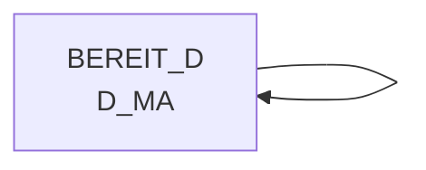

# D_MA (Table)

## Table Description

_No description available_

## Lineage / Impact

## References

The table D_MA is used in the following SAS programs:

| Application | SAS Program |
|---|---|
| [DWABVARAL](../../Applications/DWABVARAL) | [snow_abv_aral_einlesen.sas](../../Applications/DWABVARAL/snow_abv_aral_einlesen.sas) |
## Table Schema

| Field Name | Datatype | Precision | Scale | Is Nullable | Constraint | Description |
|---|---|---|---|---|---|---|
| MA_ID | INTEGER | 10 | 0 | FALSE | PRIMARY KEY | Market ID - unique identifier for each market/store |
| ILN_WARE | VARCHAR | 13 | 0 | TRUE |   | International Location Number for goods - used for matching with ARAL partner numbers |
| MA_GUELT_VON | DATE |  |  | TRUE |   | Market validity start date - beginning of validity period for market data |
| MA_GUELT_BIS | DATE |  |  | TRUE |   | Market validity end date - end of validity period for market data |
| MA_NAME | VARCHAR | 100 | 0 | TRUE |   | Market name - descriptive name of the market/store |
| MA_STATUS | VARCHAR | 10 | 0 | TRUE |   | Market status - current operational status of the market |
| MA_TYP | VARCHAR | 20 | 0 | TRUE |   | Market type - classification of market type |
| REGION_ID | INTEGER | 5 | 0 | TRUE |   | Region ID - identifier for geographical region |
| KONZ_NR | INTEGER | 9 | 0 | TRUE |   | Konzern number - corporate group identifier |
| VLT_ID | VARCHAR | 3 | 0 | TRUE |   | Currency ID - currency identifier for transactions |