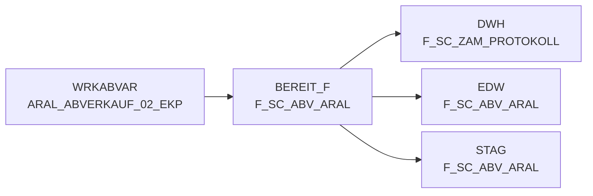

# F_SC_ABV_ARAL (Table)

## Table Description

The **DWABVARAL** application processes Aral fuel station sales data through a comprehensive ETL pipeline. This table serves as the **final staging area** for processed Aral sales transactions before loading into the data warehouse.

The application handles the complete lifecycle of Aral sales data processing: **file movement** from DFUE directories, **decompression** of raw data files, **data parsing** and validation, **purchase price evaluation**, and **final preparation** for warehouse loading. Key processing includes EAN-to-NAN article mapping, market ID resolution, tax classification, and comprehensive sales metrics calculation.

This table contains **enriched transactional data** with both original Aral fields (transaction details, amounts, quantities) and derived warehouse fields (article IDs, market mappings, evaluation metrics). The data supports **sales analysis**, **inventory management**, and **financial reporting** across the Aral fuel station network.

Processing includes **data quality checks**, sequential file validation, and **error handling** with detailed logging. The application ensures data integrity through control record validation and maintains **audit trails** via protocol tables. Successfully processed data flows to **Snowflake staging** and subsequently to the enterprise data warehouse for **business intelligence** and **analytical reporting**.

## Lineage / Impact



## Statements

The following statements create/modify this table:

<Util>CREATE TABLE</Util> inside [DWABVARAL/abv_aral_bereit.sas](../../Applications/DWABVARAL/abv_aral_bereit.sas):
```sql:line-numbers
DATA BEREIT_F.F_SC_ABV_ARAL(KEEP= ARAL_SATZ_ART ARAL_PART_NR ARAL_WAEHRUNG ARAL_VERKAUF_DATUM ARAL_VERKAUF_ZEIT ARAL_VERKAUF_ORT ARAL_BELEG ARAL_MWST_TYP ARAL_EAN ARAL_MENGE ARAL_VK_MNG_EINH ARAL_BMENGE ARAL_MNG_EINH ARAL_MATNR ARAL_NAN ARAL_BETRAG ARAL_EK_PREIS ARAL_VK_PREIS ARAL_GES_BETRAG ARAL_KRED_KL ARAL_VK_BETRAG_NTO ARAL_GES_BETRAG_NTO LFD_NR_ROHDATEI MA_ID KAL_TAG_ID LFD_NR_LOAD NAN_ART_ID AKT_KZ VLT_ID UMS_ART_ID KOPF_ART_ID STAT_KZ_ID ABT_NR ABV_EAN FREMD_ARTIKEL_TYP_ID FREMD_ARTIKEL_NR FREMD_MARKT_TYP_ID FREMD_MARKT_NR KONZ_NR ABV_W_NN_EK ABV_W_BEW_EK ABV_W_WGP_EK ABV_W_MARKT_EK ABV_W_RKP_EK ABV_W_NTO ABV_W_BTO ABV_W_BTO_VR ABV_W_BTO_FW ABV_MG QUELLE_ID ABV_BEWERT_ID MF_FLAG HIST_FOKUS_GRP HIST_FOKUS_SORT HIST_ABT_GRP HIST_ABT_NR AKTION_NR HIST_MWST_ID ABV_W_NN_DEK ABV_W_WGP_DEK ABV_W_NN_DEK_KORR ABV_W_WGP_DEK_KORR) 
 SET WRKABVAR.ARAL_ABVERKAUF_02_EKP 
 IF ABV_W_NN_EK = . THEN ABV_W_NN_EK = 0 
 IF ABV_W_BEW_EK = . THEN ABV_W_BEW_EK = 0 
 IF ABV_W_WGP_EK = . THEN ABV_W_WGP_EK = 0 
 IF ABV_W_MARKT_EK = . THEN ABV_W_MARKT_EK = 0 
 IF ABV_W_RKP_EK = . THEN ABV_W_RKP_EK = 0 
 IF ABV_W_NTO = . THEN ABV_W_NTO = 0 
 IF ABV_W_BTO = . THEN ABV_W_BTO = 0 
 RUN
```

## References

The table F_SC_ABV_ARAL is used in the following SAS programs:

| Application | SAS Program |
|---|---|
| [DWABVARAL](../../Applications/DWABVARAL) | [snow_abv_aral_insert_sca_delta.sas](../../Applications/DWABVARAL/snow_abv_aral_insert_sca_delta.sas) |
| [DWABVARAL](../../Applications/DWABVARAL) | [snow_abv_aral_nach_dwh.sas](../../Applications/DWABVARAL/snow_abv_aral_nach_dwh.sas) |
| [DWABVARAL](../../Applications/DWABVARAL) | [dw010990.sas](../../Applications/DWABVARAL/dw010990.sas) |
| [DWABVARAL](../../Applications/DWABVARAL) | [abv_aral_bereit.sas](../../Applications/DWABVARAL/abv_aral_bereit.sas) |
## Table Schema

| Field Name | Datatype | Precision | Scale | Is Nullable | Constraint | Description |
|---|---|---|---|---|---|---|
| ARAL_SATZ_ART | VARCHAR | 1 | 0 | TRUE |   | Satzart I = bewegungssatz T = Kontrollsatz |
| ARAL_PART_NR | VARCHAR | 13 | 0 | TRUE |   | Tankstellen GLN mit zwei führenden Nummern |
| ARAL_WAEHRUNG | VARCHAR | 5 | 0 | TRUE |   | Währungskennzeichen |
| ARAL_VERKAUF_DATUM | DATE | 0 | 0 | TRUE |   | Verkaufsdatum JJJJMMTT |
| ARAL_VERKAUF_ZEIT | TIME | 0 | 0 | TRUE |   | Verkausfzeit |
| ARAL_VERKAUF_ORT | INTEGER | 2 | 0 | TRUE |   | Verkaufsort |
| ARAL_BELEG | INTEGER | 6 | 0 | TRUE |   | Kassen-Belegnummer |
| ARAL_MWST_TYP | INTEGER | 1 | 0 | TRUE |   | MWST_TYP 1=Normal 2=Ermäßigt |
| ARAL_EAN | VARCHAR | 18 | 0 | TRUE |   | EAN |
| ARAL_MENGE | DECIMAL | 9 | 2 | TRUE |   | Menge |
| ARAL_VK_MNG_EINH | VARCHAR | 1 | 0 | TRUE |   | Verkaufsmengeneinheit als 1 |
| ARAL_BMENGE | DECIMAL | 9 | 2 | TRUE |   | Menge in SAP-Basismengeneinheit |
| ARAL_MNG_EINH | VARCHAR | 3 | 0 | TRUE |   | Basismengeneinheit |
| ARAL_MATNR | VARCHAR | 18 | 0 | TRUE |   | Artikelnummer in SAP |
| ARAL_NAN | VARCHAR | 7 | 0 | TRUE |   | REWE-Artikelnummer |
| ARAL_BETRAG | DECIMAL | 11 | 2 | TRUE |   | Verkaufsbetrag |
| ARAL_EK_PREIS | DECIMAL | 11 | 3 | TRUE |   | Einkaufspreis |
| ARAL_VK_PREIS | DECIMAL | 11 | 3 | TRUE |   | Verkaufspreis |
| ARAL_GES_BETRAG | DECIMAL | 11 | 2 | TRUE |   | Gesamtbetrag |
| ARAL_KRED_KL | VARCHAR | 4 | 0 | TRUE |   | Kreditklasse - Tabelle 'Kartenart' |
| ARAL_VK_BETRAG_NTO | DECIMAL | 11 | 2 | TRUE |   | Verkaufsbetrag ohne MWST |
| ARAL_GES_BETRAG_NTO | DECIMAL | 11 | 2 | TRUE |   | Gesmatbetrag ohne Steuern |
| LFD_NR_ROHDATEI | INTEGER | 10 | 0 | TRUE |   | Laufende Nummer der Rohdatei |
| MA_ID | INTEGER | 10 | 0 | TRUE |   | Markt ID |
| KAL_TAG_ID | DATE | 0 | 0 | TRUE |   | Kalender Tag ID |
| LFD_NR_LOAD | INTEGER | 10 | 0 | TRUE |   | Laufende Nummer des Ladevorgangs |
| NAN_ART_ID | INTEGER | 9 | 0 | TRUE |   | NAN Artikel ID |
| AKT_KZ | VARCHAR | 1 | 0 | TRUE |   | Aktualitätskennzeichen |
| VLT_ID | VARCHAR | 3 | 0 | TRUE |   | Valuta ID |
| UMS_ART_ID | INTEGER | 5 | 0 | TRUE |   | Umsatzart ID |
| KOPF_ART_ID | INTEGER | 9 | 0 | TRUE |   | Kopfart ID |
| STAT_KZ_ID | INTEGER | 5 | 0 | TRUE |   | Status Kennzeichen ID |
| ABT_NR | INTEGER | 5 | 0 | TRUE |   | Abteilungsnummer |
| ABV_EAN | VARCHAR | 14 | 0 | TRUE |   | Abverkauf EAN |
| FREMD_ARTIKEL_TYP_ID | INTEGER | 5 | 0 | TRUE |   | Fremdartikel Typ ID |
| FREMD_ARTIKEL_NR | VARCHAR | 20 | 0 | TRUE |   | Fremdartikel Nummer |
| FREMD_MARKT_TYP_ID | INTEGER | 5 | 0 | TRUE |   | Fremdmarkt Typ ID |
| FREMD_MARKT_NR | VARCHAR | 14 | 0 | TRUE |   | Fremdmarkt Nummer |
| KONZ_NR | INTEGER | 9 | 0 | TRUE |   | Konzern Nummer |
| ABV_W_NN_EK | DECIMAL | 13 | 2 | TRUE |   | Abverkaufswert Netto Einkauf |
| ABV_W_BEW_EK | DECIMAL | 13 | 2 | TRUE |   | Abverkaufswert Bewertung Einkauf |
| ABV_W_WGP_EK | DECIMAL | 13 | 2 | TRUE |   | Abverkaufswert Warengruppe Einkauf |
| ABV_W_MARKT_EK | DECIMAL | 13 | 2 | TRUE |   | Abverkaufswert Markt Einkauf |
| ABV_W_RKP_EK | DECIMAL | 13 | 2 | TRUE |   | Abverkaufswert RKP Einkauf |
| ABV_W_NTO | DECIMAL | 13 | 2 | TRUE |   | Abverkaufswert Netto |
| ABV_W_BTO | DECIMAL | 13 | 2 | TRUE |   | Abverkaufswert Brutto |
| ABV_W_BTO_VR | DECIMAL | 13 | 2 | TRUE |   | Abverkaufswert Brutto Vorjahr |
| ABV_W_BTO_FW | DECIMAL | 13 | 2 | TRUE |   | Abverkaufswert Brutto Fremdwährung |
| ABV_MG | DECIMAL | 13 | 2 | TRUE |   | Abverkaufsmenge |
| QUELLE_ID | INTEGER | 5 | 0 | TRUE |   | Quellen ID |
| ABV_BEWERT_ID | INTEGER | 5 | 0 | TRUE |   | Abverkaufsbewertung ID |
| MF_FLAG | VARCHAR | 3 | 0 | TRUE |   | MF Flag |
| HIST_FOKUS_GRP | INTEGER | 5 | 0 | TRUE |   | Historische Fokusgruppe |
| HIST_FOKUS_SORT | INTEGER | 5 | 0 | TRUE |   | Historische Fokussortierung |
| HIST_ABT_GRP | INTEGER | 5 | 0 | TRUE |   | Historische Abteilungsgruppe |
| HIST_ABT_NR | INTEGER | 5 | 0 | TRUE |   | Historische Abteilungsnummer |
| AKTION_NR | INTEGER | 11 | 0 | TRUE |   | Aktionsnummer |
| HIST_MWST_ID | INTEGER | 5 | 0 | TRUE |   | Historische Mehrwertsteuer ID |
| ABV_W_NN_DEK | DECIMAL | 13 | 2 | TRUE |   | Abverkaufswert Netto Deckung |
| ABV_W_WGP_DEK | DECIMAL | 13 | 2 | TRUE |   | Abverkaufswert Warengruppe Deckung |
| ABV_W_NN_DEK_KORR | DECIMAL | 13 | 2 | TRUE |   | Abverkaufswert Netto Deckung Korrektur |
| ABV_W_WGP_DEK_KORR | DECIMAL | 13 | 2 | TRUE |   | Abverkaufswert Warengruppe Deckung Korrektur |