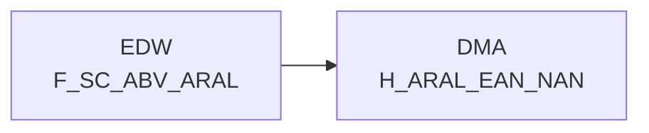

# H_ARAL_EAN_NAN (Table)

## Table Description

_No description available_

## Lineage / Impact

## References

The table H_ARAL_EAN_NAN is used in the following SAS programs:

| Application | SAS Program |
|---|---|
| [DWABVARAL](../../Applications/DWABVARAL) | [snow_abv_aral_verdichtungen.sas](../../Applications/DWABVARAL/snow_abv_aral_verdichtungen.sas) |
## Table Schema

| Field Name | Datatype | Precision | Scale | Is Nullable | Constraint | Description |
|---|---|---|---|---|---|---|
| NAN_ART_ID | INTEGER | 9 | 0 | FALSE | PRIMARY KEY | REWE article number identifier |
| ARAL_MATNR | VARCHAR | 18 | 0 | TRUE |   | SAP material number from Aral |
| ARAL_EAN_ID | BIGINT | 14 | 0 | FALSE |   | Aral EAN identifier with prefix 10000000000000 |
| ARAL_MWST_TYP | INTEGER | 1 | 0 | TRUE |   | VAT type indicator (1=Normal 2=Reduced) |