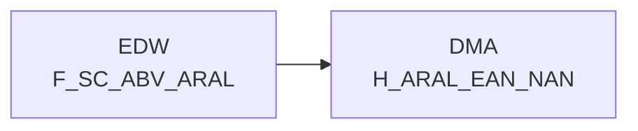

# H_ARAL_EAN_NAN (Table)

## Table Description

**DWABVARAL** is a data warehouse application that processes **Aral fuel station sales data** (Abverkaufsdaten) within a retail analytics system.

The application handles the complete **ETL pipeline** for Aral sales transactions, including:
- **Data ingestion** from raw files delivered via DFUE interface
- **File processing** with validation and error handling
- **Data transformation** including EAN-to-NAN mapping and purchase price evaluation
- **Loading** into staging and production data warehouse tables

The **H_ARAL_EAN_NAN table** serves as a **reference mapping table** that links Aral's EAN codes to internal NAN article identifiers. This table is populated during the data processing workflow and contains the relationship between:
- **NAN_ART_ID**: Internal article identifier
- **ARAL_MATNR**: SAP material number from Aral
- **ARAL_EAN_ID**: Transformed EAN identifier
- **ARAL_MWST_TYP**: VAT type classification

This mapping table is essential for **article master data reconciliation** and enables consistent reporting across different product identification systems used by Aral and the data warehouse.

## Lineage / Impact



## Statements

The following statements create/modify this table:

<Util>INSERT</Util> inside [DWABVARAL/snow_abv_aral_verdichtungen.sas](../../Applications/DWABVARAL/snow_abv_aral_verdichtungen.sas):
```sql:line-numbers
DELETE FROM DMA.H_ARAL_EAN_NAN;
INSERT INTO DMA.H_ARAL_EAN_NAN
SELECT
NAN_ART_ID,
ARAL_MATNR,
CAST((10000000000000 + CASE WHEN trim(ARAL_EAN)='' THEN 0 ELSE ARAL_EAN END) AS BIGINT) AS ARAL_EAN_ID,
ARAL_MWST_TYP
FROM
EDW.F_SC_ABV_ARAL
GROUP BY
NAN_ART_ID,
ARAL_MATNR,
ARAL_EAN,
ARAL_MWST_TYP;
commit;
```

## References

The table H_ARAL_EAN_NAN is used in the following SAS programs:

| Application | SAS Program |
|---|---|
| [DWABVARAL](../../Applications/DWABVARAL) | [snow_abv_aral_verdichtungen.sas](../../Applications/DWABVARAL/snow_abv_aral_verdichtungen.sas) |
## Table Schema

| Field Name | Datatype | Precision | Scale | Is Nullable | Constraint | Description |
|---|---|---|---|---|---|---|
| NAN_ART_ID | INTEGER | 9 | 0 | FALSE | PRIMARY KEY | REWE article number identifier |
| ARAL_MATNR | VARCHAR | 18 | 0 | TRUE |   | SAP material number from Aral |
| ARAL_EAN_ID | BIGINT | 14 | 0 | FALSE |   | Aral EAN identifier with prefix 10000000000000 |
| ARAL_MWST_TYP | INTEGER | 1 | 0 | TRUE |   | VAT type indicator (1=Normal 2=Reduced) |