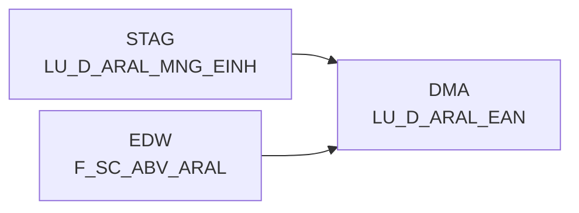

# LU_D_ARAL_EAN (Table)

## Table Description

**DWABVARAL** is a data warehouse application that processes **Aral sales data** (Abverkaufsdaten) from gas stations. The application handles the complete ETL pipeline for Aral point-of-sale transactions.

The table **LU_D_ARAL_EAN** serves as a **lookup dimension table** that stores EAN (European Article Number) codes used in Aral sales transactions. It contains standardized EAN identifiers with their corresponding raw EAN values from the source system.

This table is populated during the data processing workflow where raw Aral sales files are read, validated, and transformed. The EAN codes are converted to standardized 14-digit identifiers by adding a prefix (10000000000000) to ensure consistent formatting across the data warehouse.

The table supports **sales data analysis** and **article identification** by providing a clean mapping between the original EAN codes from Aral systems and the standardized EAN identifiers used in downstream reporting and analytics. It is refreshed daily as part of the automated ETL process that moves data from staging (STAG) to the data mart area (DMA).

This lookup table is essential for **product identification** and **sales reporting** across the Aral gas station network, enabling consistent article tracking and analysis.

## Lineage / Impact



## Statements

The following statements create/modify this table:

<Util>INSERT</Util> inside [DWABVARAL/snow_abv_aral_verdichtungen.sas](../../Applications/DWABVARAL/snow_abv_aral_verdichtungen.sas):
```sql:line-numbers
DELETE FROM DMA.LU_D_ARAL_EAN
INSERT INTO DMA.LU_D_ARAL_EAN
SELECT
CAST((10000000000000 + CASE WHEN trim(ARAL_EAN)='' THEN 0 ELSE trim(ARAL_EAN) END) AS BIGINT) AS ARAL_EAN_ID,
trim(ARAL_EAN)
FROM EDW.F_SC_ABV_ARAL
GROUP BY
trim(ARAL_EAN)
```

## References

The table LU_D_ARAL_EAN is used in the following SAS programs:

| Application | SAS Program |
|---|---|
| [DWABVARAL](../../Applications/DWABVARAL) | [snow_abv_aral_verdichtungen.sas](../../Applications/DWABVARAL/snow_abv_aral_verdichtungen.sas) |
## Table Schema

| Field Name | Datatype | Precision | Scale | Is Nullable | Constraint | Description |
|---|---|---|---|---|---|---|
| ARAL_EAN_ID | BIGINT | 19 | 0 | FALSE | PRIMARY KEY | Unique identifier for ARAL EAN code generated by adding 10000000000000 to the EAN value |
| ARAL_EAN | VARCHAR | 18 | 0 | TRUE |   | ARAL EAN code trimmed from source data |