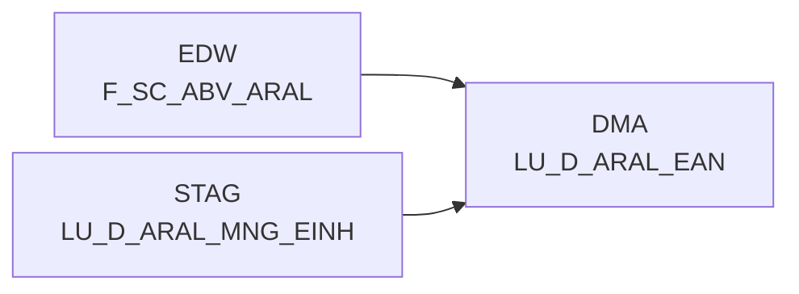

# LU_D_ARAL_EAN (Table)

## Table Description

_No description available_

## Lineage / Impact

## References

The table LU_D_ARAL_EAN is used in the following SAS programs:

| Application | SAS Program |
|---|---|
| [DWABVARAL](../../Applications/DWABVARAL) | [snow_abv_aral_verdichtungen.sas](../../Applications/DWABVARAL/snow_abv_aral_verdichtungen.sas) |
## Table Schema

| Field Name | Datatype | Precision | Scale | Is Nullable | Constraint | Description |
|---|---|---|---|---|---|---|
| ARAL_EAN_ID | BIGINT | 19 | 0 | FALSE | PRIMARY KEY | Unique identifier for ARAL EAN code generated by adding 10000000000000 to the EAN value |
| ARAL_EAN | VARCHAR | 18 | 0 | TRUE |   | ARAL EAN code trimmed from source data |