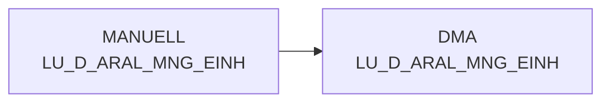

# LU_D_ARAL_MNG_EINH (Table)

## Table Description

_No description available_

## Lineage / Impact

## References

The table LU_D_ARAL_MNG_EINH is used in the following SAS programs:

| Application | SAS Program |
|---|---|
| [DWABVARAL](../../Applications/DWABVARAL) | [snow_abv_aral_verdichtungen.sas](../../Applications/DWABVARAL/snow_abv_aral_verdichtungen.sas) |
## Table Schema

| Field Name | Datatype | Precision | Scale | Is Nullable | Constraint | Description |
|---|---|---|---|---|---|---|
| ARAL_MNG_ID | INTEGER | 5 | 0 | FALSE | PRIMARY KEY | Aral Mengeneinheit ID - Verkaufsmengeneinheit als 1 |
| ARAL_VK_MNG_EINH | VARCHAR | 1 | 0 | TRUE |   | Verkaufsmengeneinheit als 1 |
| ARAL_MNG_EINH | VARCHAR | 3 | 0 | TRUE |   | Basismengeneinheit |
| ARAL_MNG_EINH_BEZ | VARCHAR | 50 | 0 | TRUE |   | Bezeichnung der Mengeneinheit |