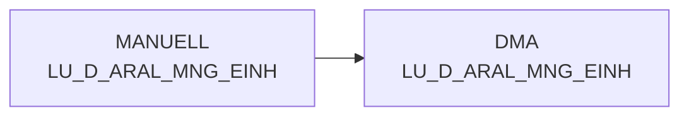

# LU_D_ARAL_MNG_EINH (Table)

## Table Description

**DWABVARAL** is a data warehouse application that processes **Aral sales data** (Abverkaufsdaten) from gas stations. This lookup table stores **Aral quantity unit mappings** and serves as a reference for unit conversions in the sales data processing pipeline.

The application handles the complete ETL process for Aral sales transactions, including data movement from staging areas, file decompression, data validation, and transformation. The table is populated from staging data (STAG.LU_D_ARAL_MNG_EINH) and provides standardized quantity unit definitions used throughout the Aral sales data processing workflow.

This table supports the broader sales analytics infrastructure by ensuring consistent unit handling across different data marts and reporting layers. It's particularly important for accurate quantity calculations and aggregations in the **S_SC_ABV_ARAL_BASIS** and related analytical tables that depend on proper unit conversions for sales volume reporting and business intelligence.

## Lineage / Impact



## Statements

The following statements create/modify this table:

<Util>INSERT</Util> inside [DWABVARAL/snow_abv_aral_verdichtungen.sas](../../Applications/DWABVARAL/snow_abv_aral_verdichtungen.sas):
```sql:line-numbers
DELETE FROM DMA.LU_D_ARAL_MNG_EINH
INSERT INTO DMA.LU_D_ARAL_MNG_EINH
SELECT * FROM STAG.LU_D_ARAL_MNG_EINH
```

## References

The table LU_D_ARAL_MNG_EINH is used in the following SAS programs:

| Application | SAS Program |
|---|---|
| [DWABVARAL](../../Applications/DWABVARAL) | [snow_abv_aral_verdichtungen.sas](../../Applications/DWABVARAL/snow_abv_aral_verdichtungen.sas) |
## Table Schema

| Field Name | Datatype | Precision | Scale | Is Nullable | Constraint | Description |
|---|---|---|---|---|---|---|
| ARAL_MNG_ID | INTEGER | 5 | 0 | FALSE | PRIMARY KEY | Aral Mengeneinheit ID - Verkaufsmengeneinheit als 1 |
| ARAL_VK_MNG_EINH | VARCHAR | 1 | 0 | TRUE |   | Verkaufsmengeneinheit als 1 |
| ARAL_MNG_EINH | VARCHAR | 3 | 0 | TRUE |   | Basismengeneinheit |
| ARAL_MNG_EINH_BEZ | VARCHAR | 50 | 0 | TRUE |   | Bezeichnung der Mengeneinheit |