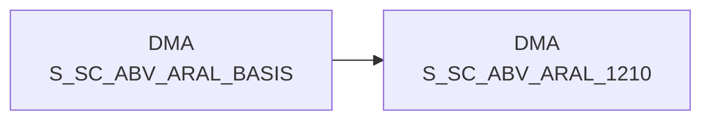

# S_SC_ABV_ARAL_1210 (Table)

## Table Description

_No description available_

## Lineage / Impact

## References

The table S_SC_ABV_ARAL_1210 is used in the following SAS programs:

| Application | SAS Program |
|---|---|
| [DWABVARAL](../../Applications/DWABVARAL) | [snow_abv_aral_verdichtungen.sas](../../Applications/DWABVARAL/snow_abv_aral_verdichtungen.sas) |
## Table Schema

| Field Name | Datatype | Precision | Scale | Is Nullable | Constraint | Description |
|---|---|---|---|---|---|---|
| MA_ID | NUMBER | 10 | 0 | TRUE |   | Market ID - Identifier for the market/store |
| KAL_TAG_ID | DATE |  |  | FALSE | PRIMARY KEY | Calendar day ID - Date dimension key |
| NAN_ART_ID | NUMBER | 9 | 0 | FALSE | PRIMARY KEY | Article ID - REWE article number identifier |
| ARAL_MENGE | NUMBER | 13 | 2 | TRUE |   | Total quantity sold for Aral products |
| ANZAHL_TEILPOS | NUMBER | 10 | 0 | TRUE |   | Number of partial positions/line items |
| ANZAHL_POS | NUMBER | 10 | 0 | TRUE |   | Number of positions where ARAL_TEILPOS equals 1 |
| ANZAHL_BELEG | NUMBER | 10 | 0 | TRUE |   | Number of distinct receipts/transactions |