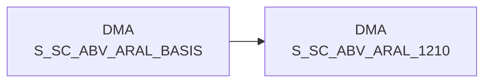

# S_SC_ABV_ARAL_1210 (Table)

## Table Description

The **DWABVARAL** application processes **Aral sales data** for the data warehouse environment. This table contains **aggregated daily sales data** from Aral gas stations, summarizing transactions by market (MA_ID), calendar day (KAL_TAG_ID), and article number (NAN_ART_ID).

The application handles the complete **ETL pipeline** for Aral point-of-sale data, including:
- **Data ingestion** from raw files delivered via DFUE interface
- **File validation** and sequential processing with error handling
- **Data transformation** including EAN-to-NAN mapping and purchase price evaluation
- **Aggregation** to daily summaries per market and article

This specific table serves as a **consolidated view** for reporting and analytics, containing key metrics like total quantities sold (ARAL_MENGE), number of individual line items (ANZAHL_TEILPOS), unique positions (ANZAHL_POS), and distinct receipts (ANZAHL_BELEG). The data supports **business intelligence** requirements for Aral retail operations analysis and is integrated into the broader **F_SC_ABV_KONZERN** framework for cross-brand sales reporting.

The table is populated through a **multi-step process** involving data movement, decompression, validation, enrichment with master data, purchase price evaluation, and final aggregation from the detailed transaction level.

## Lineage / Impact



## Statements

The following statements create/modify this table:

<Util>INSERT</Util> inside [DWABVARAL/snow_abv_aral_verdichtungen.sas](../../Applications/DWABVARAL/snow_abv_aral_verdichtungen.sas):
```sql:line-numbers
DELETE FROM DMA.S_SC_ABV_ARAL_1210
INSERT INTO DMA.S_SC_ABV_ARAL_1210
SELECT MA_ID,
KAL_TAG_ID,
NAN_ART_ID,
SUM(ARAL_MENGE) AS ARAL_MENGE,
COUNT(ARAL_TEILPOS) AS ANZAHL_TEILPOS,
SUM(CASE WHEN ARAL_TEILPOS = 1 THEN 1 ELSE 0 END) AS ANZAHL_POS,
COUNT(distinct ARAL_BELEG) AS ANZAHL_BELEG
FROM DMA.S_SC_ABV_ARAL_BASIS
GROUP BY MA_ID, KAL_TAG_ID, NAN_ART_ID
```

## References

The table S_SC_ABV_ARAL_1210 is used in the following SAS programs:

| Application | SAS Program |
|---|---|
| [DWABVARAL](../../Applications/DWABVARAL) | [snow_abv_aral_verdichtungen.sas](../../Applications/DWABVARAL/snow_abv_aral_verdichtungen.sas) |
## Table Schema

| Field Name | Datatype | Precision | Scale | Is Nullable | Constraint | Description |
|---|---|---|---|---|---|---|
| MA_ID | NUMBER | 10 | 0 | TRUE |   | Market ID - Identifier for the market/store |
| KAL_TAG_ID | DATE |  |  | FALSE | PRIMARY KEY | Calendar day ID - Date dimension key |
| NAN_ART_ID | NUMBER | 9 | 0 | FALSE | PRIMARY KEY | Article ID - REWE article number identifier |
| ARAL_MENGE | NUMBER | 13 | 2 | TRUE |   | Total quantity sold for Aral products |
| ANZAHL_TEILPOS | NUMBER | 10 | 0 | TRUE |   | Number of partial positions/line items |
| ANZAHL_POS | NUMBER | 10 | 0 | TRUE |   | Number of positions where ARAL_TEILPOS equals 1 |
| ANZAHL_BELEG | NUMBER | 10 | 0 | TRUE |   | Number of distinct receipts/transactions |