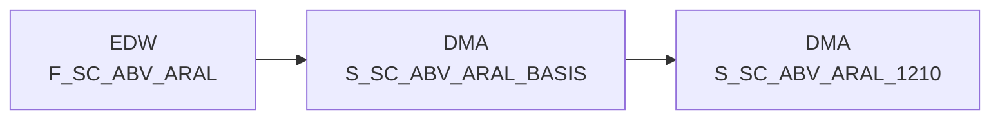

# S_SC_ABV_ARAL_BASIS (Table)

## Table Description

_No description available_

## Lineage / Impact

## References

The table S_SC_ABV_ARAL_BASIS is used in the following SAS programs:

| Application | SAS Program |
|---|---|
| [DWABVARAL](../../Applications/DWABVARAL) | [snow_abv_aral_verdichtungen.sas](../../Applications/DWABVARAL/snow_abv_aral_verdichtungen.sas) |
## Table Schema

| Field Name | Datatype | Precision | Scale | Is Nullable | Constraint | Description |
|---|---|---|---|---|---|---|
| MA_ID | INTEGER | 10 | 0 | TRUE |   | Market ID - Tankstellen GLN identifier |
| KAL_TAG_ID | DATE |  |  | FALSE | PRIMARY KEY | Calendar day ID - Verkaufsdatum |
| NAN_ART_ID | INTEGER | 9 | 0 | FALSE | PRIMARY KEY | REWE article number ID |
| ARAL_PART_NR | VARCHAR | 13 |  | FALSE | PRIMARY KEY | Tankstellen GLN mit zwei führenden Nummern |
| ARAL_VERKAUF_ZEIT | TIME |  |  | FALSE | PRIMARY KEY | Verkaufszeit - sales time |
| ARAL_VERKAUF_ORT | SMALLINT | 2 | 0 | FALSE | PRIMARY KEY | Verkaufsort - sales location |
| ARAL_BELEG | INTEGER | 6 | 0 | FALSE | PRIMARY KEY | Kassen-Belegnummer - receipt number |
| ARAL_MWST_TYP | SMALLINT | 1 | 0 | FALSE |   | MWST_TYP 1=Normal 2=Ermäßigt - VAT type |
| ARAL_EAN_ID | BIGINT | 14 | 0 | FALSE |   | EAN identifier derived from ARAL_EAN |
| ARAL_MENGE | DECIMAL | 9 | 2 | FALSE |   | Menge - quantity sold |
| ARAL_MNG_ID | SMALLINT | 3 | 0 | FALSE |   | Mengeneinheit ID derived from VK_MNG_EINH |
| ARAL_BMENGE | DECIMAL | 9 | 2 | FALSE |   | Menge in SAP-Basismengeneinheit - base quantity |
| ARAL_MATNR | VARCHAR | 18 |  | FALSE |   | Artikelnummer in SAP - SAP material number |
| ARAL_NAN | VARCHAR | 7 |  | FALSE |   | REWE-Artikelnummer - REWE article number |
| ARAL_AKT_KZ | VARCHAR | 1 |  | FALSE |   | Aktiv Kennzeichen A=Aktiv D=Dummy - active indicator |
| ARAL_TEILPOS | INTEGER |  |  | FALSE |   | FALSE |