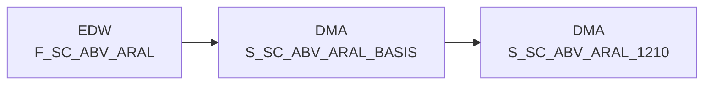

# S_SC_ABV_ARAL_BASIS (Table)

## Table Description

The **DWABVARAL** application processes Aral fuel station sales data through a comprehensive ETL pipeline. This table serves as the **basis aggregation layer** for Aral sales transactions, containing deduplicated and standardized sales records.

The application handles the complete data flow from raw file processing to data warehouse integration. It **moves compressed sales files** from staging directories, **validates file sequences**, and **processes semicolon-delimited transaction records**. Each record includes detailed sales information such as station identifiers, timestamps, product codes, quantities, and pricing data.

Key processing steps include **EAN-to-NAN article mapping**, **market ID resolution** using validity periods, **purchase price evaluation**, and **tax classification**. The system performs comprehensive **data quality checks** including record count validation and sequential file verification.

This basis table specifically stores **individual transaction positions** with generated row numbers for duplicate handling, **standardized EAN identifiers**, and **article classification flags**. It supports downstream aggregations for reporting and analytics, feeding into concentrated views like daily summaries and article hierarchies.

The application integrates with **Snowflake data warehouse** and maintains **audit trails** through protocol tables, ensuring data lineage and processing transparency for business intelligence and regulatory compliance.

## Lineage / Impact



## Statements

The following statements create/modify this table:

<Util>INSERT</Util> inside [DWABVARAL/snow_abv_aral_verdichtungen.sas](../../Applications/DWABVARAL/snow_abv_aral_verdichtungen.sas):
```sql:line-numbers
DELETE FROM DMA.S_SC_ABV_ARAL_BASIS
INSERT INTO DMA.S_SC_ABV_ARAL_BASIS
SELECT
MA_ID,
KAL_TAG_ID,
NAN_ART_ID,
ARAL_PART_NR,
ARAL_VERKAUF_ZEIT,
ARAL_VERKAUF_ORT,
ARAL_BELEG,
ARAL_MWST_TYP,
CAST((10000000000000 + CASE WHEN trim(ARAL_EAN)='' THEN 0 ELSE ARAL_EAN END) AS BIGINT) AS ARAL_EAN_ID,
ARAL_MENGE,
CAST((100 + ARAL_VK_MNG_EINH) AS SMALLINT) AS ARAL_MNG_ID,
ARAL_BMENGE,
ARAL_MATNR,
ARAL_NAN,
CASE WHEN AKT_KZ = 'A' THEN 'A' ELSE 'D' END AS ARAL_AKT_KZ,
ROW_NUMBER() OVER (PARTITION BY
MA_ID,
KAL_TAG_ID,
NAN_ART_ID,
ARAL_PART_NR,
ARAL_VERKAUF_ZEIT,
ARAL_VERKAUF_ORT,
ARAL_BELEG,
ARAL_MWST_TYP,
ARAL_EAN,
ARAL_MENGE,
ARAL_VK_MNG_EINH,
ARAL_BMENGE,
ARAL_MATNR,
ARAL_NAN,
AKT_KZ ORDER BY MA_ID, KAL_TAG_ID, NAN_ART_ID, ARAL_BELEG, ARAL_VERKAUF_ORT, ARAL_VERKAUF_ZEIT) AS ARAL_TEILPOS
FROM EDW.F_SC_ABV_ARAL
```

## References

The table S_SC_ABV_ARAL_BASIS is used in the following SAS programs:

| Application | SAS Program |
|---|---|
| [DWABVARAL](../../Applications/DWABVARAL) | [snow_abv_aral_verdichtungen.sas](../../Applications/DWABVARAL/snow_abv_aral_verdichtungen.sas) |
## Table Schema

| Field Name | Datatype | Precision | Scale | Is Nullable | Constraint | Description |
|---|---|---|---|---|---|---|
| MA_ID | INTEGER | 10 | 0 | TRUE |   | Market ID - Tankstellen GLN identifier |
| KAL_TAG_ID | DATE |  |  | FALSE | PRIMARY KEY | Calendar day ID - Verkaufsdatum |
| NAN_ART_ID | INTEGER | 9 | 0 | FALSE | PRIMARY KEY | REWE article number ID |
| ARAL_PART_NR | VARCHAR | 13 |  | FALSE | PRIMARY KEY | Tankstellen GLN mit zwei führenden Nummern |
| ARAL_VERKAUF_ZEIT | TIME |  |  | FALSE | PRIMARY KEY | Verkaufszeit - sales time |
| ARAL_VERKAUF_ORT | SMALLINT | 2 | 0 | FALSE | PRIMARY KEY | Verkaufsort - sales location |
| ARAL_BELEG | INTEGER | 6 | 0 | FALSE | PRIMARY KEY | Kassen-Belegnummer - receipt number |
| ARAL_MWST_TYP | SMALLINT | 1 | 0 | FALSE |   | MWST_TYP 1=Normal 2=Ermäßigt - VAT type |
| ARAL_EAN_ID | BIGINT | 14 | 0 | FALSE |   | EAN identifier derived from ARAL_EAN |
| ARAL_MENGE | DECIMAL | 9 | 2 | FALSE |   | Menge - quantity sold |
| ARAL_MNG_ID | SMALLINT | 3 | 0 | FALSE |   | Mengeneinheit ID derived from VK_MNG_EINH |
| ARAL_BMENGE | DECIMAL | 9 | 2 | FALSE |   | Menge in SAP-Basismengeneinheit - base quantity |
| ARAL_MATNR | VARCHAR | 18 |  | FALSE |   | Artikelnummer in SAP - SAP material number |
| ARAL_NAN | VARCHAR | 7 |  | FALSE |   | REWE-Artikelnummer - REWE article number |
| ARAL_AKT_KZ | VARCHAR | 1 |  | FALSE |   | Aktiv Kennzeichen A=Aktiv D=Dummy - active indicator |
| ARAL_TEILPOS | INTEGER |  |  | FALSE |   | FALSE |