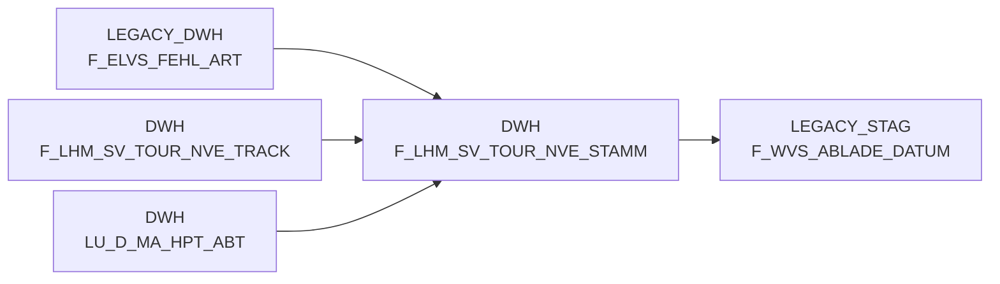

# F_LHM_SV_TOUR_NVE_STAMM (Table)

## Table Description

_No description available_

## Lineage / Impact

## References

The table F_LHM_SV_TOUR_NVE_STAMM is used in the following SAS programs:

| Application | SAS Program |
|---|---|
| [BDWH_SCCWVS](../../Applications/BDWH_SCCWVS) | [sccwvs_005_wvs_ablade_tag.sas](../../Applications/BDWH_SCCWVS/sccwvs_005_wvs_ablade_tag.sas) |
| [BDWH_SCCWVS](../../Applications/BDWH_SCCWVS) | [sccwvs_020_wvs_berechnen_elab.sas](../../Applications/BDWH_SCCWVS/sccwvs_020_wvs_berechnen_elab.sas) |
## Table Schema

| Field Name | Datatype | Precision | Scale | Is Nullable | Constraint | Description |
|---|---|---|---|---|---|---|
| NVE_ID | BIGINT | 19 | 0 | FALSE | PRIMARY KEY | Unique identifier for NVE (Nummer der Versandeinheit) |
| NVE | BIGINT | 19 | 0 | TRUE |   | NVE number for shipment unit |
| MA_ID | BIGINT | 19 | 0 | TRUE |   | Market identifier |
| ERSTELL_DATUM | DATE | 10 | 0 | TRUE |   | Creation date of the NVE record |
| TRANSPORT_STUFE | INTEGER | 10 | 0 | TRUE |   | Transport stage level |
| NVE_STATUS | INTEGER | 10 | 0 | TRUE |   | Current status of the NVE |
| NVE_STATUS_FAIL | VARCHAR | 1 | 0 | TRUE |   | Failure status indicator for NVE |
| VERDICHTET_AUF_NVE_ID | BIGINT | 19 | 0 | TRUE |   | Reference to consolidated NVE ID |
| NVE_ID_ORG | BIGINT | 19 | 0 | TRUE |   | Original NVE ID before consolidation |