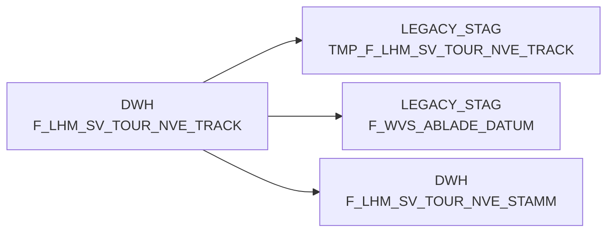

# F_LHM_SV_TOUR_NVE_TRACK (Table)

## Table Description

**BDWH_SCCWVS** is a **WarenVersorgungsStatistik (WVS)** application that builds a parallel environment to replace the legacy LEGACY_DWH system in PRODUCT_SCC_PROD. The application processes supply chain statistics and logistics data for retail operations.

The **F_LHM_SV_TOUR_NVE_TRACK** table serves as a critical data source within this WVS ecosystem, containing **NVE (Nummer der Versandeinheit) tracking information** for logistics tours and shipments. This table tracks the movement and status of shipping units through various transportation stages, capturing essential delivery and logistics data.

The table is primarily used in the **discharge day determination process** (sccwvs_005_wvs_ablade_tag.sas), where it helps identify delivery dates for the last 28 days by filtering records with specific NVE_STATUS values (210, 245, 246, 250, 255) and non-failed status indicators. The data supports **recursive tracking** of shipping unit hierarchies and enables the calculation of actual delivery dates versus planned delivery schedules.

This logistics tracking data is fundamental for **supply chain analytics**, **delivery performance monitoring**, and **warehouse management reporting** within the broader WVS statistical framework, ultimately supporting retail supply chain optimization and performance measurement.

## Lineage / Impact

## Statements

The following statements create/modify this table:

## References

The table F_LHM_SV_TOUR_NVE_TRACK is used in the following SAS programs:

| Application | SAS Program |
|---|---|
| [BDWH_SCCWVS](../../Applications/BDWH_SCCWVS) | [sccwvs_005_wvs_ablade_tag.sas](../../Applications/BDWH_SCCWVS/sccwvs_005_wvs_ablade_tag.sas) |
## Table Schema

| Field Name | Datatype | Precision | Scale | Is Nullable | Constraint | Description |
|---|---|---|---|---|---|---|
| NVE_ID | BIGINT | 19 | 0 | TRUE |   | NVE identifier for tracking |
| NVE_ID_ORG | BIGINT | 19 | 0 | TRUE |   | Original NVE identifier |
| VERDICHTET_AUF_NVE_ID | BIGINT | 19 | 0 | TRUE |   | Consolidated NVE identifier |
| NVE_STATUS | INTEGER | 10 | 0 | TRUE |   | NVE status code |
| NVE_STATUS_FAIL | VARCHAR | 1 | 0 | TRUE |   | NVE status failure indicator |
| TRANSPORT_STUFE | INTEGER | 10 | 0 | TRUE |   | Transport stage level |
| TRACK_TS | TIMESTAMP_NTZ | 29 | 9 | TRUE |   | Tracking timestamp |