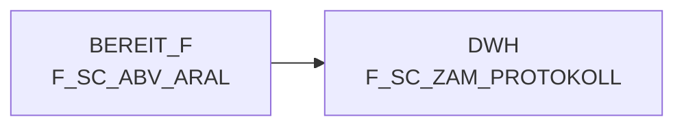

# F_SC_ZAM_PROTOKOLL (Table)

## Table Description

The **DWABVARAL** application processes **Aral sales data** within a comprehensive data warehouse pipeline. This system handles the complete lifecycle of Aral fuel station sales transactions, from raw data ingestion to final data warehouse storage.

The application manages multiple critical processes including **data movement** from staging areas, **file decompression** and validation, **sales data parsing** with detailed transaction information (timestamps, locations, products, amounts), and **data enrichment** with market and article identifiers. It performs **purchase price evaluations** and **data quality checks** to ensure transaction integrity.

Key functionalities include **protocol logging** for audit trails, **metadata management** for tracking data lineage, **data aggregation** for reporting purposes, and **integration** with downstream systems. The system processes various data formats including EAN codes, market identifiers, sales amounts, and tax classifications.

The application supports **restart capabilities** for failed jobs and includes comprehensive **error handling** with specific contact information for issue resolution. It maintains **historical data** and supports both **delta processing** and **full data loads** to the data warehouse, ensuring consistent and reliable sales data availability for business intelligence and reporting purposes.

## Lineage / Impact



## Statements

The following statements create/modify this table:

<Util>INSERT</Util> inside [DWABVARAL/snow_abv_aral_insert_sca_delta.sas](../../Applications/DWABVARAL/snow_abv_aral_insert_sca_delta.sas):
```sql:line-numbers
select max(lfd_nr_load) + 1 as neue_LFD_NR_LOAD into: mlfd_nr_load
from dwh.f_sc_zam_protokoll
```

## References

The table F_SC_ZAM_PROTOKOLL is used in the following SAS programs:

| Application | SAS Program |
|---|---|
| [DWABVARAL](../../Applications/DWABVARAL) | [snow_abv_aral_insert_sca_delta.sas](../../Applications/DWABVARAL/snow_abv_aral_insert_sca_delta.sas) |
## Table Schema

| Field Name | Datatype | Precision | Scale | Is Nullable | Constraint | Description |
|---|---|---|---|---|---|---|
| lfd_nr_load | INTEGER | 10 | 0 | FALSE | PRIMARY KEY | Sequential load number for tracking data loads |
| datum | DATE |  |  | FALSE |   | Date of the protocol entry |
| zeit | TIME |  |  | FALSE |   | Time of the protocol entry |
| rohdatei | VARCHAR | 50 |  | FALSE |   | Name of the raw data file processed |
| lfd_nr_rohdatei | INTEGER | 10 | 0 | FALSE |   | Sequential number of the raw data file |
| gelesene_saetze | INTEGER | 10 | 0 | TRUE |   | Number of records read from the file |
| geladene_saetze | INTEGER | 10 | 0 | TRUE |   | Number of records successfully loaded |
| status | VARCHAR | 10 |  | TRUE |   | Processing status of the file |
| fehler_beschreibung | VARCHAR | 500 |  | TRUE |   | Description of any errors encountered during processing |