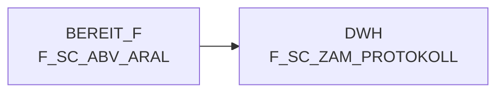

# F_SC_ZAM_PROTOKOLL (Table)

## Table Description

_No description available_

## Lineage / Impact

## References

The table F_SC_ZAM_PROTOKOLL is used in the following SAS programs:

| Application | SAS Program |
|---|---|
| [DWABVARAL](../../Applications/DWABVARAL) | [snow_abv_aral_insert_sca_delta.sas](../../Applications/DWABVARAL/snow_abv_aral_insert_sca_delta.sas) |
## Table Schema

| Field Name | Datatype | Precision | Scale | Is Nullable | Constraint | Description |
|---|---|---|---|---|---|---|
| lfd_nr_load | INTEGER | 10 | 0 | FALSE | PRIMARY KEY | Sequential load number for tracking data loads |
| datum | DATE |  |  | FALSE |   | Date of the protocol entry |
| zeit | TIME |  |  | FALSE |   | Time of the protocol entry |
| rohdatei | VARCHAR | 50 |  | FALSE |   | Name of the raw data file processed |
| lfd_nr_rohdatei | INTEGER | 10 | 0 | FALSE |   | Sequential number of the raw data file |
| gelesene_saetze | INTEGER | 10 | 0 | TRUE |   | Number of records read from the file |
| geladene_saetze | INTEGER | 10 | 0 | TRUE |   | Number of records successfully loaded |
| status | VARCHAR | 10 |  | TRUE |   | Processing status of the file |
| fehler_beschreibung | VARCHAR | 500 |  | TRUE |   | Description of any errors encountered during processing |