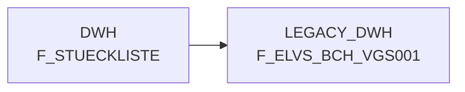

# F_STUECKLISTE (Table)

## Table Description

The **F_STUECKLISTE** table is a core component of the **BDWH_SCCWVS** application, which implements the **WVS (WarenVersorgungsStatistik)** - Goods Supply Statistics system. This application is building a parallel environment to replace the legacy LEGACY_DWH system within PRODUCT_SCC_PROD.

The table stores **bill of materials (Stückliste)** data and plays a crucial role in supplier determination processes for WVS calculations. It is specifically used to identify **sales articles with bill of materials type 20** for all warehouses, enabling the system to determine suppliers for position articles derived from head articles (++V/++L relationships).

Key usage contexts include:
- **Supplier identification** for articles where the commissioning pool data is incomplete (approximately 25% missing supplier information)
- **Multi-stage supplier determination** process that examines goods receipt data from recent days to establish consistent supplier relationships
- **Article hierarchy resolution** where sales articles are broken down into their component parts

The table supports the WVS system's core functionality of analyzing supply chain performance, shortage reasons, and delivery statistics across the retail network. It integrates with various other components including goods receipt tracking, pricing tables, and commissioning data to provide comprehensive supply chain analytics.

## Lineage / Impact

## Statements

The following statements create/modify this table:

## References

The table F_STUECKLISTE is used in the following SAS programs:

| Application | SAS Program |
|---|---|
| [BDWH_SCCWVS](../../Applications/BDWH_SCCWVS) | [sccwvs_400_fakt_n_dwh.sas](../../Applications/BDWH_SCCWVS/sccwvs_400_fakt_n_dwh.sas) |
## Table Schema

| Field Name | Datatype | Precision | Scale | Is Nullable | Constraint | Description |
|---|---|---|---|---|---|---|