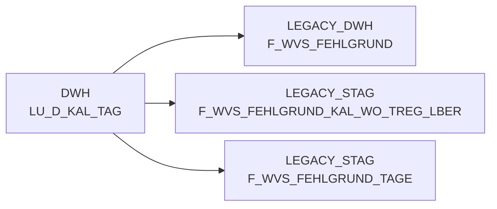

# LU_D_KAL_TAG (Table)

## Table Description

_No description available_

## Lineage / Impact

## References

The table LU_D_KAL_TAG is used in the following SAS programs:

| Application | SAS Program |
|---|---|
| [BDWH_SCCWVS](../../Applications/BDWH_SCCWVS) | [sccwvs_500_wvs_aggregate.sas](../../Applications/BDWH_SCCWVS/sccwvs_500_wvs_aggregate.sas) |
| [BDWH_SCCWVS](../../Applications/BDWH_SCCWVS) | [sccwvs_020_wvs_berechnen_elab.sas](../../Applications/BDWH_SCCWVS/sccwvs_020_wvs_berechnen_elab.sas) |
## Table Schema

| Field Name | Datatype | Precision | Scale | Is Nullable | Constraint | Description |
|---|---|---|---|---|---|---|
| KAL_TAG_ID | DATE |  |  | FALSE | PRIMARY KEY | Calendar date identifier - unique date value for calendar lookups |
| KAL_WO_ID | INTEGER |  |  | TRUE | FOREIGN KEY | Calendar week identifier - reference to calendar week dimension |
| KAL_JAHR | INTEGER | 4 | 0 | TRUE |   | Calendar year - four digit year value |
| KAL_MONAT | INTEGER | 2 | 0 | TRUE |   | Calendar month - numeric month value (1-12) |
| KAL_TAG | INTEGER | 2 | 0 | TRUE |   | Calendar day - numeric day of month (1-31) |
| KAL_WOCHENTAG | INTEGER | 1 | 0 | TRUE |   | Calendar weekday - numeric day of week (1-7) |
| KAL_QUARTAL | INTEGER | 1 | 0 | TRUE |   | Calendar quarter - numeric quarter value (1-4) |
| KAL_TAG_NAME | VARCHAR | 20 |  | TRUE |   | Calendar day name - textual representation of weekday |
| KAL_MONAT_NAME | VARCHAR | 20 |  | TRUE |   | Calendar month name - textual representation of month |
| FEIERTAG_KZ | VARCHAR | 1 |  | TRUE |   | Holiday indicator - flag indicating if date is a holiday |