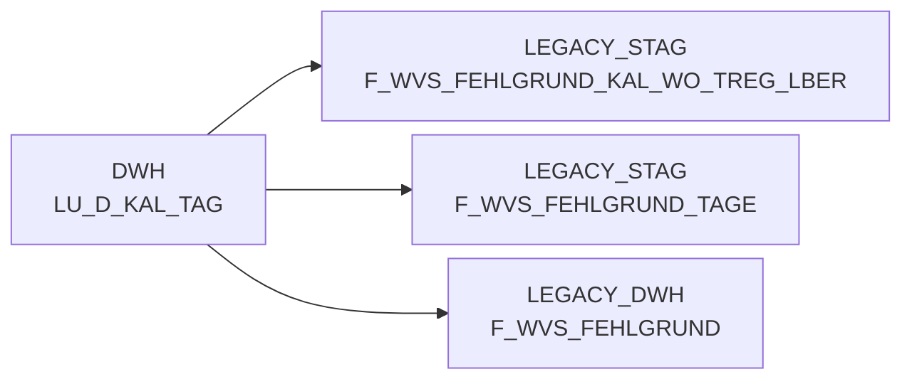

# LU_D_KAL_TAG (Table)

## Table Description

**BDWH_SCCWVS** is a **WarenVersorgungsStatistik (WVS)** application that builds a parallel environment to LEGACY_DWH in PRODUCT_SCC_PROD for system replacement purposes.

The table **LU_D_KAL_TAG** serves as a **calendar day lookup dimension** that provides essential date-related attributes and hierarchical calendar information. This lookup table is utilized throughout the WVS processing chain to support temporal data operations and date-based filtering.

The table is referenced in multiple WVS scripts for:
- **Date range calculations** (determining processing windows of last 21-28 days)
- **Calendar week aggregations** (KAL_WO_ID mappings for weekly reporting)
- **Temporal data filtering** in fact table processing
- **Date validation** and boundary checks in supply chain analytics

As a core dimensional table, it enables the WVS system to perform accurate time-based analysis of supply shortages, delivery tracking, and inventory management across different calendar periods. The table supports the application's daily processing cycle that calculates supply statistics retrospectively for 2-week periods.

## Lineage / Impact



## Statements

The following statements create/modify this table:

<Util>INSERT</Util> inside [BDWH_SCCWVS/sccwvs_005_wvs_ablade_tag.sas](../../Applications/BDWH_SCCWVS/sccwvs_005_wvs_ablade_tag.sas):
```sql:line-numbers
INSERT INTO PRODUCT_SCC_PROD.LEGACY_STAG.F_WVS_ABLADE_DATUM
select
a.ma_hpt_abt_id, a.ma_lag_id, a.lagnr, a.refnr, a.pos_refnr_lfdnr, a.kal_tag_id,
NULL as ablade_tag,
case when max(track.nve_status) in (250) then max(cast(track.track_ts as date))
when max(track.nve_status) in (255) and max(track.nve_status) not in (245) then max(cast(a.kal_tag_id +1 as date))
when max(track.nve_status) in (245) and max(track.nve_status) not in (250) then max(cast(a.kal_tag_id +1 as date))
when max(track.nve_status) in (246) and max(track.nve_status) not in (245) then max(cast(a.kal_tag_id +1 as date))
else max(cast(a.kal_tag_id +1 as date))
end as ablade_tag_sv,
case when max(track.nve_status) in (250) then 1
when max(track.nve_status) in (255) and max(track.nve_status) not in (245) then 2
when max(track.nve_status) in (245) and max(track.nve_status) not in (250) then 3
when max(track.nve_status) in (246) and max(track.nve_status) not in (245) then 4
else 5
end as ablade_tag_kz
from (select ma_hpt_abt_id, ma_lag_id, lagnr, refnr, pos_refnr_lfdnr, kal_tag_id, lif_nve,
pos_leergutkz, kopf_storno_kz from PRODUCT_SCC_PROD.LEGACY_DWH.F_ELVS_FEHL_ART
where herkunft_basis='ELAB'
and kal_tag_id >= dateadd(day,-21,CURRENT_DATE) )a
left join LEGACY_DWH.DWH.LU_D_MA_HPT_ABT c
on a.ma_hpt_abt_id = c.ma_hpt_abt_id
left join (
select * from LEGACY_DWH.DWH.F_LHM_SV_TOUR_NVE_STAMM
where erstell_datum >=dateadd(day,-28,CURRENT_DATE)
) d
on a.lif_nve = d.nve
and c.ma_id = d.ma_id
left join (
select nve_id, nve_status, transport_stufe, track_ts, verdichtet_auf_nve_id
from PRODUCT_SCC_PROD.LEGACY_STAG.TMP_F_LHM_SV_TOUR_NVE_TRACK_2
union all
select nve_id, nve_status, transport_stufe, track_ts, verdichtet_auf_nve_id
from LEGACY_DWH.DWH.F_LHM_SV_TOUR_NVE_TRACK
where nve_status_fail <> 'f'
and nve_status in (245,246,250,255)
and cast(track_ts as date) >= dateadd(day,-28,CURRENT_DATE)
) track
on d.nve_id = track.nve_id
where a.kal_tag_id >= dateadd(day,-21,CURRENT_DATE)
and a.lif_nve <> 0
and a.pos_leergutkz <> 'l'
and a.kopf_storno_kz not in ('s', 'x', 'y')
AND NOT EXISTS
( SELECT * FROM PRODUCT_SCC_PROD.LEGACY_STAG.F_WVS_ABLADE_DATUM t1
WHERE
a.kal_tag_id = t1.kal_tag_id
AND a.ma_hpt_abt_id = t1.ma_hpt_abt_id
AND a.ma_lag_id = t1.ma_lag_id
AND a.lagnr = t1.lagnr
AND a.refnr = t1.refnr
AND a.pos_refnr_lfdnr = t1.pos_refnr_lfdnr
)
group by a.ma_hpt_abt_id, a.ma_lag_id, a.lagnr, a.refnr, a.pos_refnr_lfdnr, a.kal_tag_id
```

## References

The table LU_D_KAL_TAG is used in the following SAS programs:

| Application | SAS Program |
|---|---|
| [BDWH_SCCWVS](../../Applications/BDWH_SCCWVS) | [sccwvs_020_wvs_berechnen_elab.sas](../../Applications/BDWH_SCCWVS/sccwvs_020_wvs_berechnen_elab.sas) |
| [BDWH_SCCWVS](../../Applications/BDWH_SCCWVS) | [sccwvs_500_wvs_aggregate.sas](../../Applications/BDWH_SCCWVS/sccwvs_500_wvs_aggregate.sas) |
## Table Schema

| Field Name | Datatype | Precision | Scale | Is Nullable | Constraint | Description |
|---|---|---|---|---|---|---|
| KAL_TAG_ID | DATE |  |  | FALSE | PRIMARY KEY | Calendar date identifier - unique date value for calendar lookups |
| KAL_WO_ID | INTEGER |  |  | TRUE | FOREIGN KEY | Calendar week identifier - reference to calendar week dimension |
| KAL_JAHR | INTEGER | 4 | 0 | TRUE |   | Calendar year - four digit year value |
| KAL_MONAT | INTEGER | 2 | 0 | TRUE |   | Calendar month - numeric month value (1-12) |
| KAL_TAG | INTEGER | 2 | 0 | TRUE |   | Calendar day - numeric day of month (1-31) |
| KAL_WOCHENTAG | INTEGER | 1 | 0 | TRUE |   | Calendar weekday - numeric day of week (1-7) |
| KAL_QUARTAL | INTEGER | 1 | 0 | TRUE |   | Calendar quarter - numeric quarter value (1-4) |
| KAL_TAG_NAME | VARCHAR | 20 |  | TRUE |   | Calendar day name - textual representation of weekday |
| KAL_MONAT_NAME | VARCHAR | 20 |  | TRUE |   | Calendar month name - textual representation of month |
| FEIERTAG_KZ | VARCHAR | 1 |  | TRUE |   | Holiday indicator - flag indicating if date is a holiday |