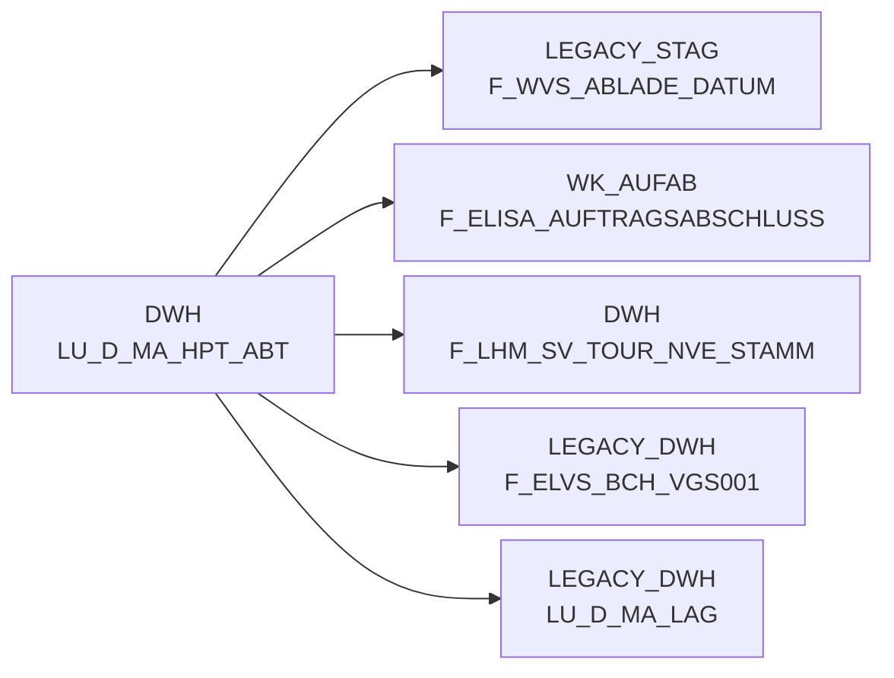

# LU_D_MA_HPT_ABT (Table)

## Table Description

_No description available_

## Lineage / Impact

## References

The table LU_D_MA_HPT_ABT is used in the following SAS programs:

| Application | SAS Program |
|---|---|
| [DWELISAAUFTRAB](../../Applications/DWELISAAUFTRAB) | [snow_auftragsabschlussmeldung_fa_mapping.sas](../../Applications/DWELISAAUFTRAB/snow_auftragsabschlussmeldung_fa_mapping.sas) |
| [BDWH_SCCWVS](../../Applications/BDWH_SCCWVS) | [sccwvs_400_fakt_n_dwh.sas](../../Applications/BDWH_SCCWVS/sccwvs_400_fakt_n_dwh.sas) |
| [BDWH_SCCWVS](../../Applications/BDWH_SCCWVS) | [sccwvs_020_wvs_berechnen_elab.sas](../../Applications/BDWH_SCCWVS/sccwvs_020_wvs_berechnen_elab.sas) |
| [BDWH_SCCWVS](../../Applications/BDWH_SCCWVS) | [sccwvs_005_wvs_ablade_tag.sas](../../Applications/BDWH_SCCWVS/sccwvs_005_wvs_ablade_tag.sas) |
## Table Schema

| Field Name | Datatype | Precision | Scale | Is Nullable | Constraint | Description |
|---|---|---|---|---|---|---|
| MA_HPT_ABT_ID | NUMBER | 12 | 0 | FALSE | PRIMARY KEY | Market headquarters department identifier |
| MA_ID | NUMBER | 10 | 0 | TRUE |   | Market identifier |
| MA_TREG_LBER_ID | NUMBER | 8 | 0 | TRUE |   | Market trading region delivery area identifier |
| MA_HPT_ABT_TXT | VARCHAR | 100 | 0 | TRUE |   | Market headquarters department description |
| MA_HPT_ABT_KURZ_TXT | VARCHAR | 20 | 0 | TRUE |   | Market headquarters department short description |
| GUELT_VON | DATE | 0 | 0 | TRUE |   | Valid from date |
| GUELT_BIS | DATE | 0 | 0 | TRUE |   | Valid until date |
| SATZ_STATUS | VARCHAR | 1 | 0 | TRUE |   | Record status indicator |
| ERSTELL_DATUM | TIMESTAMP_NTZ | 0 | 0 | TRUE |   | Record creation timestamp |
| AENDER_DATUM | TIMESTAMP_NTZ | 0 | 0 | TRUE |   | Record modification timestamp |