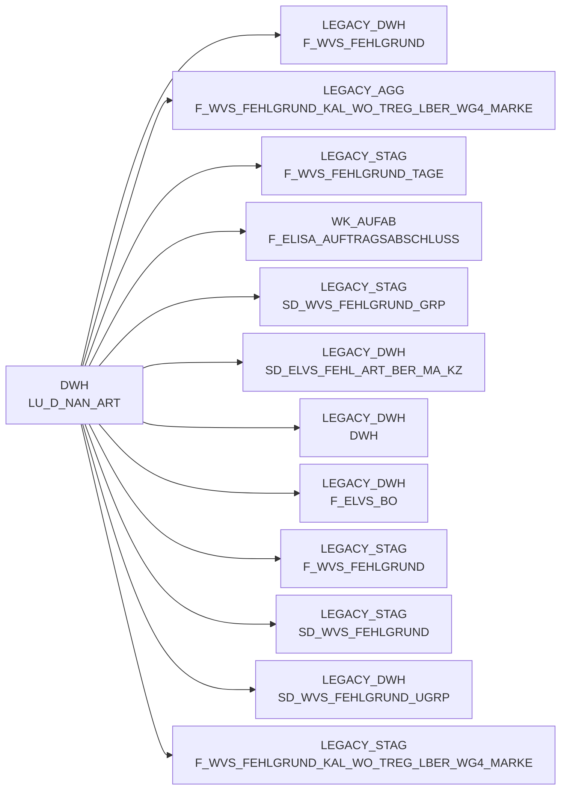

# LU_D_NAN_ART (Table)

## Table Description

_No description available_

## Lineage / Impact

## References

The table LU_D_NAN_ART is used in the following SAS programs:

| Application | SAS Program |
|---|---|
| [DWELISAAUFTRAB](../../Applications/DWELISAAUFTRAB) | [snow_auftragsabschlussmeldung_fa_mapping.sas](../../Applications/DWELISAAUFTRAB/snow_auftragsabschlussmeldung_fa_mapping.sas) |
| [BDWH_SCCWVS](../../Applications/BDWH_SCCWVS) | [sccwvs_500_wvs_aggregate.sas](../../Applications/BDWH_SCCWVS/sccwvs_500_wvs_aggregate.sas) |
| [BDWH_SCCWVS](../../Applications/BDWH_SCCWVS) | [sccwvs_020_wvs_berechnen_elab.sas](../../Applications/BDWH_SCCWVS/sccwvs_020_wvs_berechnen_elab.sas) |
## Table Schema

| Field Name | Datatype | Precision | Scale | Is Nullable | Constraint | Description |
|---|---|---|---|---|---|---|
| NAN_ART_ID | NUMBER | 38 | 0 | FALSE | PRIMARY KEY | Unique identifier for NAN article |
| WG_2_ID | NUMBER | 38 | 0 | TRUE |   | Product group level 2 identifier |
| WG4_MARKE_ID | NUMBER | 38 | 0 | TRUE |   | Product group level 4 brand identifier |
| NAN_ART_NR | VARCHAR | 20 | 0 | TRUE |   | NAN article number |
| NAN_ART_TXT | VARCHAR | 255 | 0 | TRUE |   | NAN article description text |
| NAN_ART_KURZ_TXT | VARCHAR | 50 | 0 | TRUE |   | NAN article short description |
| GTIN | VARCHAR | 14 | 0 | TRUE |   | Global Trade Item Number |
| ERSTELL_DATUM | DATE | 0 | 0 | TRUE |   | Creation date of the record |
| AENDERUNG_DATUM | DATE | 0 | 0 | TRUE |   | Last modification date of the record |
| SATZ_STATUS | VARCHAR | 1 | 0 | TRUE |   | Record status indicator |