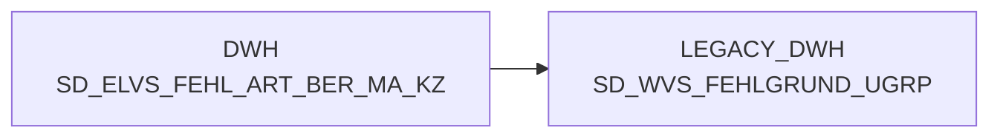

# SD_ELVS_FEHL_ART_BER_MA_KZ (Table)

## Table Description

**BDWH_SCCWVS** is a **WarenVersorgungsStatistik (WVS)** application that builds a parallel environment to replace the legacy ELVS system in PRODUCT_SCC_PROD. The application processes supply chain statistics and shortage analysis for retail operations.

This table **SD_ELVS_FEHL_ART_BER_MA_KZ** serves as a **reference dimension** for market authorization indicators (**BER_MA_KZ**) used in the WVS shortage analysis workflow. It contains authorization mappings that determine which shortage reasons are valid for specific market types or regions.

The table is utilized in the **shortage reason classification process** where it joins with other WVS tables to validate and categorize supply shortages based on market authorization criteria. It plays a crucial role in the **multi-stage WVS calculation pipeline** that processes delivery data, determines shortage reasons, identifies suppliers, and generates aggregated supply statistics.

The application runs daily and processes the **last 21 days** of data, performing shortage analysis, supplier identification, and relevance marking for supply chain monitoring and reporting purposes.

## Lineage / Impact



## Statements

The following statements create/modify this table:

<Util>INSERT</Util> inside [BDWH_SCCWVS/sccwvs_020_wvs_berechnen_elab.sas](../../Applications/BDWH_SCCWVS/sccwvs_020_wvs_berechnen_elab.sas):
```sql:line-numbers
INSERT INTO PRODUCT_SCC_PROD.LEGACY_STAG.F_WVS_ABLADE_DATUM
select
a.ma_hpt_abt_id, a.ma_lag_id, a.lagnr, a.refnr, a.pos_refnr_lfdnr, a.kal_tag_id,
NULL as ablade_tag,
case when max(track.nve_status) in (250) then max(cast(track.track_ts as date))
when max(track.nve_status) in (255) and max(track.nve_status) not in (245) then max(cast(a.kal_tag_id +1 as date))
when max(track.nve_status) in (245) and max(track.nve_status) not in (250) then max(cast(a.kal_tag_id +1 as date))
when max(track.nve_status) in (246) and max(track.nve_status) not in (245) then max(cast(a.kal_tag_id +1 as date))
else max(cast(a.kal_tag_id +1 as date))
end as ablade_tag_sv,
case when max(track.nve_status) in (250) then 1
when max(track.nve_status) in (255) and max(track.nve_status) not in (245) then 2
when max(track.nve_status) in (245) and max(track.nve_status) not in (250) then 3
when max(track.nve_status) in (246) and max(track.nve_status) not in (245) then 4
else 5
end as ablade_tag_kz
from (select ma_hpt_abt_id, ma_lag_id, lagnr, refnr, pos_refnr_lfdnr, kal_tag_id, lif_nve,
pos_leergutkz, kopf_storno_kz from PRODUCT_SCC_PROD.LEGACY_DWH.F_ELVS_FEHL_ART
where herkunft_basis='ELAB'
and kal_tag_id >= dateadd(day,-21,CURRENT_DATE) )a
left join LEGACY_DWH.DWH.LU_D_MA_HPT_ABT c
on a.ma_hpt_abt_id = c.ma_hpt_abt_id
left join (
select * from LEGACY_DWH.DWH.F_LHM_SV_TOUR_NVE_STAMM
where erstell_datum >=dateadd(day,-28,CURRENT_DATE)
) d
on a.lif_nve = d.nve
and c.ma_id = d.ma_id
left join (
select nve_id, nve_status, transport_stufe, track_ts, verdichtet_auf_nve_id
from PRODUCT_SCC_PROD.LEGACY_STAG.TMP_F_LHM_SV_TOUR_NVE_TRACK_2
union all
select nve_id, nve_status, transport_stufe, track_ts, verdichtet_auf_nve_id
from LEGACY_DWH.DWH.F_LHM_SV_TOUR_NVE_TRACK
where nve_status_fail <> 'f'
and nve_status in (245,246,250,255)
and cast(track_ts as date) >= dateadd(day,-28,CURRENT_DATE)
) track
on d.nve_id = track.nve_id
where a.kal_tag_id >= dateadd(day,-21,CURRENT_DATE)
and a.lif_nve <> 0
and a.pos_leergutkz <> 'l'
and a.kopf_storno_kz not in ('s', 'x', 'y')
AND NOT EXISTS
( SELECT * FROM PRODUCT_SCC_PROD.LEGACY_STAG.F_WVS_ABLADE_DATUM t1
WHERE
a.kal_tag_id = t1.kal_tag_id
AND a.ma_hpt_abt_id = t1.ma_hpt_abt_id
AND a.ma_lag_id = t1.ma_lag_id
AND a.lagnr = t1.lagnr
AND a.refnr = t1.refnr
AND a.pos_refnr_lfdnr = t1.pos_refnr_lfdnr
)
group by a.ma_hpt_abt_id, a.ma_lag_id, a.lagnr, a.refnr, a.pos_refnr_lfdnr, a.kal_tag_id
```

## References

The table SD_ELVS_FEHL_ART_BER_MA_KZ is used in the following SAS programs:

| Application | SAS Program |
|---|---|
| [BDWH_SCCWVS](../../Applications/BDWH_SCCWVS) | [sccwvs_400_fakt_n_dwh.sas](../../Applications/BDWH_SCCWVS/sccwvs_400_fakt_n_dwh.sas) |
## Table Schema

| Field Name | Datatype | Precision | Scale | Is Nullable | Constraint | Description |
|---|---|---|---|---|---|---|