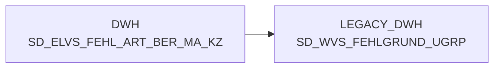

# SD_ELVS_FEHL_ART_BER_MA_KZ (Table)

## Table Description

_No description available_

## Lineage / Impact

## References

The table SD_ELVS_FEHL_ART_BER_MA_KZ is used in the following SAS programs:

| Application | SAS Program |
|---|---|
| [BDWH_SCCWVS](../../Applications/BDWH_SCCWVS) | [sccwvs_400_fakt_n_dwh.sas](../../Applications/BDWH_SCCWVS/sccwvs_400_fakt_n_dwh.sas) |
## Table Schema

| Field Name | Datatype | Precision | Scale | Is Nullable | Constraint | Description |
|---|---|---|---|---|---|---|