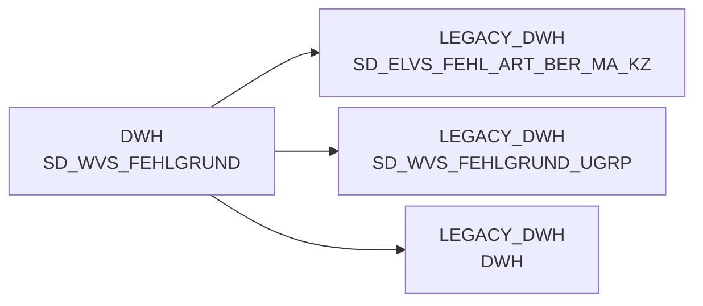

# SD_WVS_FEHLGRUND (Table)

## Table Description

**WVS Fehlgrund Master Data Table**

This table is part of the **BDWH_SCCWVS** application, which implements the **Waren-Versorgungs-Statistik (WVS)** - Goods Supply Statistics system. The application is building a parallel environment to replace the legacy ELVS system in the PRODUCT_SCC_PROD environment.

The table contains master data for **failure reason codes** (*Fehlgründe*) used in the WVS system to categorize and analyze supply chain issues. These codes are essential for identifying why goods were not delivered as planned, enabling detailed supply chain analysis and reporting.

The table supports the core WVS calculation process, particularly in script **sccwvs_020_wvs_berechnen_elab.sas**, which performs line-by-line resolution of shortage quantities and values by reasons. The failure reasons are mapped from various source fields like *pos_kv_ursache* and *pos_fehler_schl* to standardized *fehl_art_grund_id* values.

Key failure reason categories include supplier issues, warehouse shortages, disposition problems, action week deliveries, and various operational constraints. The system distinguishes between different warehouse types and product groups (O+G vs. others) when assigning failure reasons.

This master data is crucial for WVS relevance determination, aggregate calculations, and supply chain performance reporting across the retail network.

## Lineage / Impact

## Statements

The following statements create/modify this table:

## References

The table SD_WVS_FEHLGRUND is used in the following SAS programs:

| Application | SAS Program |
|---|---|
| [BDWH_SCCWVS](../../Applications/BDWH_SCCWVS) | [sccwvs_400_fakt_n_dwh.sas](../../Applications/BDWH_SCCWVS/sccwvs_400_fakt_n_dwh.sas) |
## Table Schema

| Field Name | Datatype | Precision | Scale | Is Nullable | Constraint | Description |
|---|---|---|---|---|---|---|