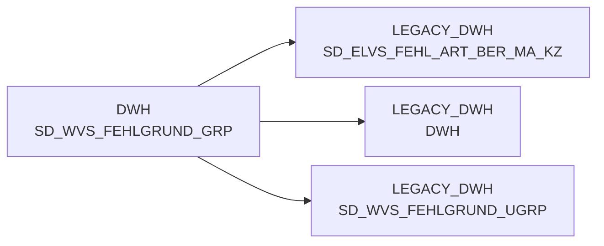

# SD_WVS_FEHLGRUND_GRP (Table)

## Table Description

**WVS Fehlgrund Group Dimension Table**

This table is part of the **BDWH_SCCWVS** application, which implements the **Warenversorgungsstatistik (WVS)** - Goods Supply Statistics system. The application builds a parallel environment to replace the legacy ELVS system with ELAB-based data processing.

The table serves as a **dimension table for WVS failure reason groups** and contains hierarchical classification data for supply chain failure analysis. It stores group-level categorizations that help organize and classify different types of supply failures in the retail supply chain.

This table is populated and maintained through the WVS processing pipeline, which includes data extraction from ELAB sources, failure reason determination, supplier identification, and relevance assessment. The table supports the comprehensive analysis of supply chain performance by providing structured categorization of failure reasons at the group level.

The table is used in conjunction with other WVS dimension tables (classes, subgroups, and individual failure reasons) to create a complete hierarchical structure for failure reason analysis and reporting in the goods supply statistics system.

## Lineage / Impact



## Statements

The following statements create/modify this table:

<Util>CREATE TABLE</Util> inside [BDWH_SCCWVS/sccwvs_400_fakt_n_dwh.sas](../../Applications/BDWH_SCCWVS/sccwvs_400_fakt_n_dwh.sas):
```sql:line-numbers
CREATE TABLE LEGACY_DWH.DWH.SD_WVS_FEHLGRUND_GRP AS
SELECT DISTINCT c.FEHL_ART_GRUND_GRP_ID,c.FEHL_ART_GRUND_GRP_TXT
FROM LEGACY_DWH.DWH.SD_WVS_FEHLGRUND a
LEFT JOIN LEGACY_DWH.DWH.SD_WVS_FEHLGRUND_UGRP b
ON a.FEHL_ART_GRUND_UGRP_ID = b.FEHL_ART_GRUND_UGRP_ID
LEFT JOIN LEGACY_DWH.DWH.SD_WVS_FEHLGRUND_GRP c
ON b.FEHL_ART_GRUND_GRP_ID = c.FEHL_ART_GRUND_GRP_ID
```

## References

The table SD_WVS_FEHLGRUND_GRP is used in the following SAS programs:

| Application | SAS Program |
|---|---|
| [BDWH_SCCWVS](../../Applications/BDWH_SCCWVS) | [sccwvs_400_fakt_n_dwh.sas](../../Applications/BDWH_SCCWVS/sccwvs_400_fakt_n_dwh.sas) |
## Table Schema

| Field Name | Datatype | Precision | Scale | Is Nullable | Constraint | Description |
|---|---|---|---|---|---|---|