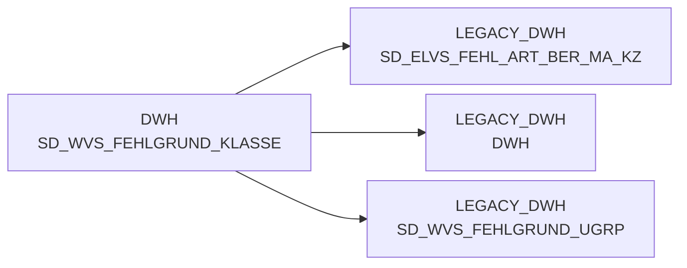

# SD_WVS_FEHLGRUND_KLASSE (Table)

## Table Description

_No description available_

## Lineage / Impact

## References

The table SD_WVS_FEHLGRUND_KLASSE is used in the following SAS programs:

| Application | SAS Program |
|---|---|
| [BDWH_SCCWVS](../../Applications/BDWH_SCCWVS) | [sccwvs_400_fakt_n_dwh.sas](../../Applications/BDWH_SCCWVS/sccwvs_400_fakt_n_dwh.sas) |
## Table Schema

| Field Name | Datatype | Precision | Scale | Is Nullable | Constraint | Description |
|---|---|---|---|---|---|---|
| FEHL_ART_GRUND_KLASSE_ID | NUMBER | 7 | 0 | FALSE | PRIMARY KEY | Unique identifier for the error reason class |
| FEHL_ART_GRUND_KLASSE_TXT | VARCHAR | 100 | 0 | TRUE |   | Description text for the error reason class |
| BERECHTIGT_MARKT_KZ | VARCHAR | 10 | 0 | TRUE |   | Market authorization indicator |
| ERSTELL_DATUM | DATE | 0 | 0 | TRUE |   | Creation date of the record |
| AENDER_DATUM | DATE | 0 | 0 | TRUE |   | Last modification date of the record |