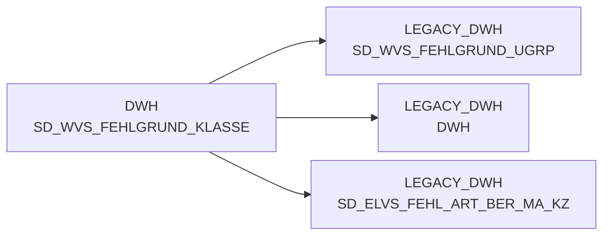

# SD_WVS_FEHLGRUND_KLASSE (Table)

## Table Description

**WVS (WarenVersorgungsStatistik) Fehlgrund Classification Table**

This table is part of the **BDWH_SCCWVS** application, which manages the **Goods Supply Statistics (WVS)** system. The application is building a parallel environment to replace the legacy LEGACY_DWH system in PRODUCT_SCC_PROD.

The table serves as a **classification dimension** for WVS failure reasons, providing the highest level categorization in the WVS failure reason hierarchy. It contains failure reason class definitions with attributes like:
- **FEHL_ART_GRUND_KLASSE_ID**: Unique identifier for failure reason classes
- **FEHL_ART_GRUND_KLASSE_TXT**: Descriptive text for failure reason classes
- **BERECHTIGT_MARKT_KZ**: Market authorization indicator

This table is used in conjunction with related tables (SD_WVS_FEHLGRUND_GRP, SD_WVS_FEHLGRUND_UGRP, SD_WVS_FEHLGRUND) to create a complete hierarchical structure for categorizing supply chain failures. The classification enables detailed analysis of delivery shortfalls, stock-outs, and other supply chain issues across different market segments and organizational levels.

The table supports the core WVS calculation process that runs daily and processes supply statistics for the last 21 days, helping identify and categorize various types of supply chain disruptions for business intelligence and operational optimization.

## Lineage / Impact



## Statements

The following statements create/modify this table:

<Util>DELETE</Util> inside [BDWH_SCCWVS/sccwvs_600_cleandb.sas](../../Applications/BDWH_SCCWVS/sccwvs_600_cleandb.sas):
```sql:line-numbers
DELETE FROM &DBName..LEGACY_STAG.SD_WVS_FEHLGRUND_KLASSE
```

## References

The table SD_WVS_FEHLGRUND_KLASSE is used in the following SAS programs:

| Application | SAS Program |
|---|---|
| [BDWH_SCCWVS](../../Applications/BDWH_SCCWVS) | [sccwvs_400_fakt_n_dwh.sas](../../Applications/BDWH_SCCWVS/sccwvs_400_fakt_n_dwh.sas) |
## Table Schema

| Field Name | Datatype | Precision | Scale | Is Nullable | Constraint | Description |
|---|---|---|---|---|---|---|
| FEHL_ART_GRUND_KLASSE_ID | NUMBER | 7 | 0 | FALSE | PRIMARY KEY | Unique identifier for the error reason class |
| FEHL_ART_GRUND_KLASSE_TXT | VARCHAR | 100 | 0 | TRUE |   | Description text for the error reason class |
| BERECHTIGT_MARKT_KZ | VARCHAR | 10 | 0 | TRUE |   | Market authorization indicator |
| ERSTELL_DATUM | DATE | 0 | 0 | TRUE |   | Creation date of the record |
| AENDER_DATUM | DATE | 0 | 0 | TRUE |   | Last modification date of the record |