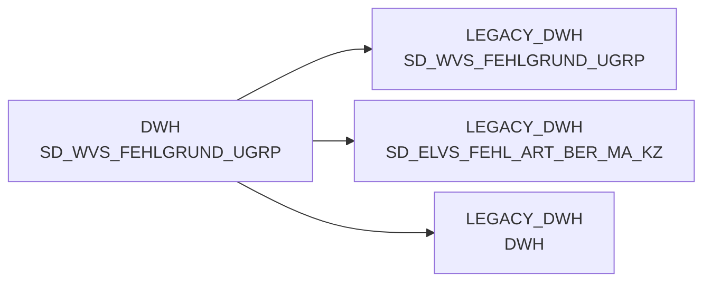

# SD_WVS_FEHLGRUND_UGRP (Table)

## Table Description

_No description available_

## Lineage / Impact

## References

The table SD_WVS_FEHLGRUND_UGRP is used in the following SAS programs:

| Application | SAS Program |
|---|---|
| [BDWH_SCCWVS](../../Applications/BDWH_SCCWVS) | [sccwvs_400_fakt_n_dwh.sas](../../Applications/BDWH_SCCWVS/sccwvs_400_fakt_n_dwh.sas) |
## Table Schema

| Field Name | Datatype | Precision | Scale | Is Nullable | Constraint | Description |
|---|---|---|---|---|---|---|
| FEHL_ART_GRUND_UGRP_ID | NUMBER | 10 | 0 | FALSE | PRIMARY KEY | Unique identifier for the failure reason subgroup |
| FEHL_ART_GRUND_UGRP_TXT | VARCHAR | 100 | 0 | TRUE |   | Description text for the failure reason subgroup |
| FEHL_ART_GRUND_GRP_ID | NUMBER | 10 | 0 | TRUE | FOREIGN KEY | Foreign key reference to failure reason group |
| ERSTELL_DATUM | DATE | 0 | 0 | TRUE |   | Record creation date |
| AENDERUNG_DATUM | DATE | 0 | 0 | TRUE |   | Record last modification date |
| SATZ_STATUS | VARCHAR | 1 | 0 | TRUE |   | Record status indicator |