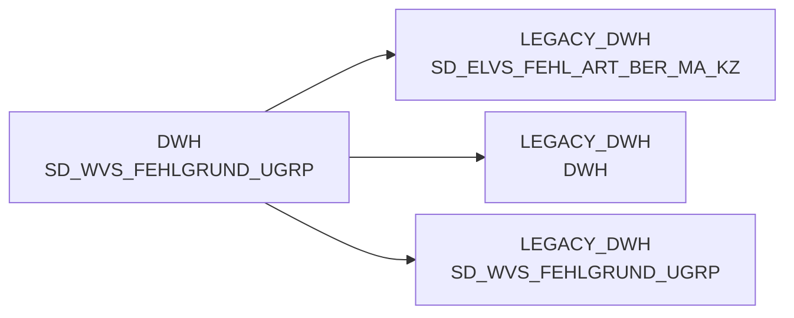

# SD_WVS_FEHLGRUND_UGRP (Table)

## Table Description

**WVS (WarenVersorgungsStatistik) Fehlgrund Untergruppen Stammdaten**

This table contains master data for **WVS failure reason subgroups** within the **BDWH_SCCWVS** application. The table serves as a reference dimension for categorizing and classifying supply chain failure reasons at the subgroup level in the goods supply statistics system.

The table is part of a **parallel environment setup** in PRODUCT_SCC_PROD designed to replace the legacy ELVS system. It supports the hierarchical classification of failure reasons where subgroups represent a mid-level categorization between detailed failure reasons and broader failure reason groups.

This stammdaten table is utilized by the WVS calculation processes, particularly in the main script *sccwvs_020_wvs_berechnen_elab.sas*, to provide proper categorization and reporting of supply chain disruptions. The table supports the **line-by-line resolution of failure quantities and values by reasons** from the F_ELVS_FEHL_ART fact table.

The table is maintained through the SCCWVS job sequence and integrates with other WVS reference tables including SD_WVS_FEHLGRUND (detailed reasons), SD_WVS_FEHLGRUND_GRP (groups), and SD_WVS_FEHLGRUND_KLASSE (classes) to form a complete failure reason hierarchy for supply statistics analysis.

## Lineage / Impact



## Statements

The following statements create/modify this table:

<Util>CREATE TABLE</Util> inside [BDWH_SCCWVS/sccwvs_250_wvs_relevant.sas](../../Applications/BDWH_SCCWVS/sccwvs_250_wvs_relevant.sas):
```sql:line-numbers
CREATE TABLE wrkwvs.f_wvs_fehlgrund_v2
as select
NAN_ART_ID format=9. ,
MA_HPT_ABT_ID format=12. ,
KAL_TAG_ID format=eurdfdd10. ,
MA_LAG_ID format=10.,
AKT_KZ format=$1.,
POS_WAEINH as WAEINH format=6. ,
LAGNR format=$3. ,
REFNR format=11. ,
POS_REFNR_LFDNR format=6. ,
FEHL_ART_GRUND_ID format=7. ,
BEST_MG format=12.3,
BEST_W_EK_BTO format=12.3,
BEST_W_WG_BTO format=12.3,
BEST_W_VK_BTO format=12.3,
FEHL_GRUND_MG format=12.3 ,
FEHL_GRUND_W_EK_BTO format=12.3,
FEHL_GRUND_W_WG_BTO format=12.3,
FEHL_GRUND_W_VK_BTO format=12.3,
LIEF_ID format=$6.,
LIEF_KZ format=$1.,
ABLADE_TAG format=eurdfdd10.,
KOPF_AUFTRAG format=11.,
KOPF_KD_AUFTRAGS_NR FORMAT=$15.,
KOPF_AENDDAT format=eurdfdd10.,
ABLADE_TAG_SV format=eurdfdd10.,
ABLADE_TAG_KZ format=2.,
HERKUNFT_BASIS length=4 format=$4.,
CASE
WHEN KOPF_HERKUNFT = 'L' THEN 0
ELSE 1
END
AS WVS_RELEVANT format=2.,
CASE
WHEN KOPF_HERKUNFT = 'I' THEN 1
WHEN KOPF_HERKUNFT = 'P' THEN 2
ELSE 0
END
AS LIEFMG_ANGEPASST format=2.
from wrkwvs.f_wvs_lief_neu
where herkunft_basis='ELAB'
```

## References

The table SD_WVS_FEHLGRUND_UGRP is used in the following SAS programs:

| Application | SAS Program |
|---|---|
| [BDWH_SCCWVS](../../Applications/BDWH_SCCWVS) | [sccwvs_400_fakt_n_dwh.sas](../../Applications/BDWH_SCCWVS/sccwvs_400_fakt_n_dwh.sas) |
## Table Schema

| Field Name | Datatype | Precision | Scale | Is Nullable | Constraint | Description |
|---|---|---|---|---|---|---|
| FEHL_ART_GRUND_UGRP_ID | NUMBER | 10 | 0 | FALSE | PRIMARY KEY | Unique identifier for the failure reason subgroup |
| FEHL_ART_GRUND_UGRP_TXT | VARCHAR | 100 | 0 | TRUE |   | Description text for the failure reason subgroup |
| FEHL_ART_GRUND_GRP_ID | NUMBER | 10 | 0 | TRUE | FOREIGN KEY | Foreign key reference to failure reason group |
| ERSTELL_DATUM | DATE | 0 | 0 | TRUE |   | Record creation date |
| AENDERUNG_DATUM | DATE | 0 | 0 | TRUE |   | Record last modification date |
| SATZ_STATUS | VARCHAR | 1 | 0 | TRUE |   | Record status indicator |