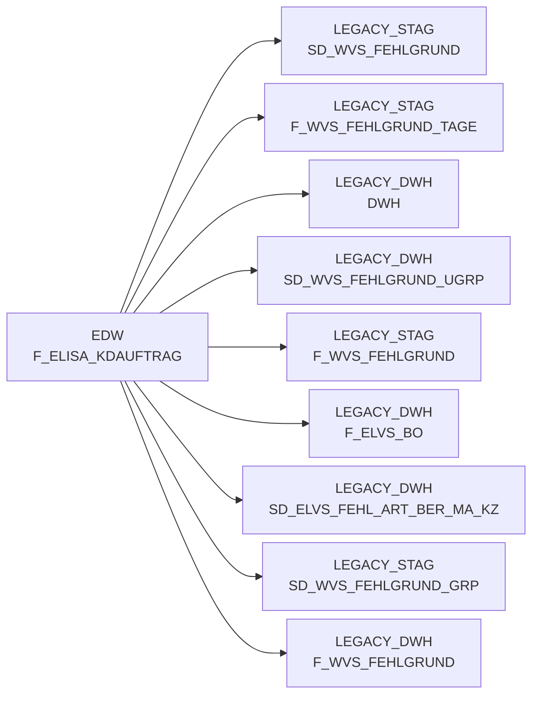

# F_ELISA_KDAUFTRAG (Table)

## Table Description

**BDWH_SCCWVS** is a **WarenVersorgungsStatistik (WVS)** application that builds a parallel environment to LEGACY_DWH in PRODUCT_SCC_PROD for system replacement purposes.

The **F_ELISA_KDAUFTRAG** table serves as a critical data source within the WVS supply statistics calculation process. It contains customer order data from the ELISA system and is primarily used in the core WVS calculation script **sccwvs_020_wvs_berechnen_elab.sas**.

This table is joined with **F_ELVS_FEHL_ART** to enrich shortage analysis data with customer order information, including order numbers, delivery dates, and error codes. The table provides essential fields like *belegnummer* (document number), *lieferdatum* (delivery date), *nan_art_id* (article ID), and *fehlerschluessel* (error key) that enable comprehensive supply chain analysis.

The application processes data from ELVS-free warehouses (HERKUNFT_BASIS = 'ELAB') and performs line-by-line resolution of shortage quantities and values by reasons. The F_ELISA_KDAUFTRAG table supports this analysis by providing the underlying customer order context necessary for accurate supply statistics reporting and warehouse performance evaluation.

## Lineage / Impact

## Statements

The following statements create/modify this table:

## References

The table F_ELISA_KDAUFTRAG is used in the following SAS programs:

| Application | SAS Program |
|---|---|
| [BDWH_SCCWVS](../../Applications/BDWH_SCCWVS) | [sccwvs_020_wvs_berechnen_elab.sas](../../Applications/BDWH_SCCWVS/sccwvs_020_wvs_berechnen_elab.sas) |
## Table Schema

| Field Name | Datatype | Precision | Scale | Is Nullable | Constraint | Description |
|---|---|---|---|---|---|---|