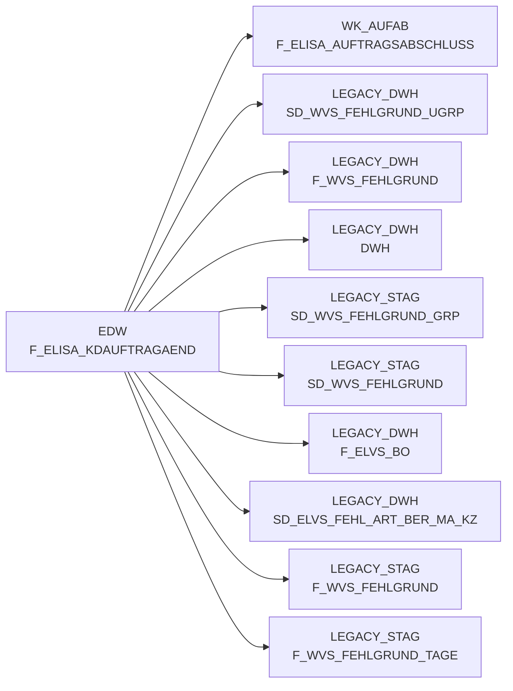

# F_ELISA_KDAUFTRAGAEND (Table)

## Table Description

_No description available_

## Lineage / Impact

## References

The table F_ELISA_KDAUFTRAGAEND is used in the following SAS programs:

| Application | SAS Program |
|---|---|
| [BDWH_SCCWVS](../../Applications/BDWH_SCCWVS) | [sccwvs_020_wvs_berechnen_elab.sas](../../Applications/BDWH_SCCWVS/sccwvs_020_wvs_berechnen_elab.sas) |
| [DWELISAAUFTRAB](../../Applications/DWELISAAUFTRAB) | [snow_auftragsabschlussmeldung_fa_mapping.sas](../../Applications/DWELISAAUFTRAB/snow_auftragsabschlussmeldung_fa_mapping.sas) |
## Table Schema

| Field Name | Datatype | Precision | Scale | Is Nullable | Constraint | Description |
|---|---|---|---|---|---|---|