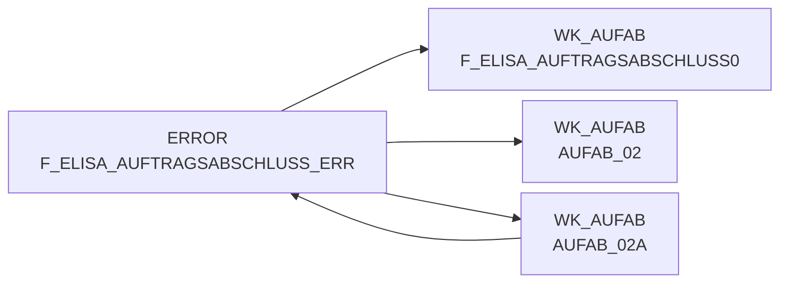

# F_ELISA_AUFTRAGSABSCHLUSS_ERR (Table)

## Table Description

_No description available_

## Lineage / Impact

## References

The table F_ELISA_AUFTRAGSABSCHLUSS_ERR is used in the following SAS programs:

| Application | SAS Program |
|---|---|
| [DWELISAAUFTRAB](../../Applications/DWELISAAUFTRAB) | [auftragsabschlussmeldung_transfrm.sas](../../Applications/DWELISAAUFTRAB/auftragsabschlussmeldung_transfrm.sas) |
## Table Schema

| Field Name | Datatype | Precision | Scale | Is Nullable | Constraint | Description |
|---|---|---|---|---|---|---|
| MA_LAG_ID | INTEGER | 8 | 0 | TRUE |   | Market-Warehouse ID for error records |
| LAG_ID | INTEGER | 4 | 0 | TRUE |   | Warehouse ID for error records |
| NAN_ART_ID | INTEGER | 9 | 0 | TRUE |   | Article ID (NAN) for error records |
| AKT_KZ | VARCHAR | 1 | 0 | TRUE |   | Action indicator for error records |
| LIEF_ID | VARCHAR | 6 | 0 | TRUE |   | Supplier ID for error records |
| MA_ID | INTEGER | 10 | 0 | TRUE |   | Market ID for error records |
| KAL_TAG_ID | DATE | 0 | 0 | TRUE |   | Calendar date ID for error records |
| BUCHUNGSDATUM | DATE | 0 | 0 | TRUE |   | Booking date for error records |
| MHDATUM | DATE | 0 | 0 | TRUE |   | Best before date for error records |
| DATEINAME | VARCHAR | 100 | 0 | TRUE |   | Source filename for error records |
| LFD_NR_ROHDAT | INTEGER | 8 | 0 | TRUE |   | Sequential number of raw data for error records |
| MENGEINGRAMMC | VARCHAR | 32 | 0 | TRUE |   | Quantity in grams as character for error records |
| SCHNITTGEWICHTINGRAMMC | VARCHAR | 32 | 0 | TRUE |   | Average weight in grams as character for error records |
| EINKAUFSPREIS¿ | VARCHAR | 10 | 0 | TRUE |   | Purchase price as character for error records |