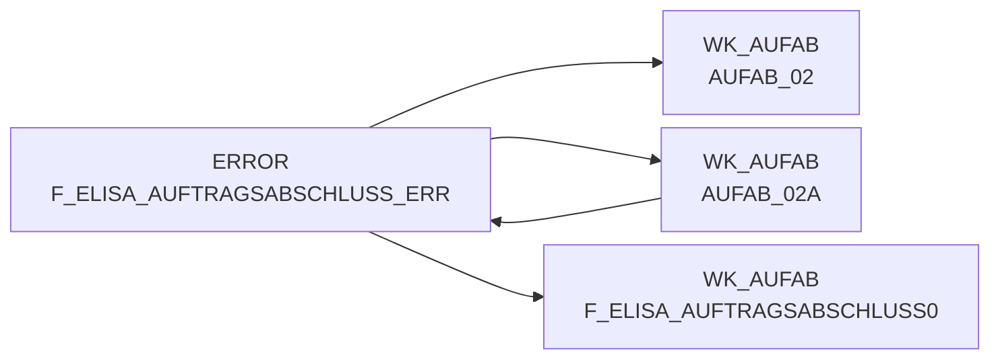

# F_ELISA_AUFTRAGSABSCHLUSS_ERR (Table)

## Table Description

This error table is part of the **DWELISAAUFTRAB** application, which processes order completion messages (Auftragsabschlussmeldung) from the ELISA system. The application handles XML messages containing order fulfillment data from pL-Store to ELISA, including commissioned quantities and order completion information.

The error table stores records that failed validation during the data transformation process. Records are written to this table when key transformations fail, such as when **MA_LAG_ID**, **LAG_ID**, **NAN_ART_ID**, or **MA_ID** cannot be properly resolved to valid values (resulting in default error values like 1000000000, 9999, 100000000).

The application runs through a **13-job sequence** that moves XML files from raw data directories, parses them using XML maps, transforms the data with master data lookups, enriches it with purchase and sales prices, loads it to staging and EDW tables, and finally maps it to the F_ELVS_FEHL_ART structure. Error records from the transformation step are permanently stored in this table for analysis and potential reprocessing.

This table serves as a **permanent error repository** allowing data quality monitoring and troubleshooting of master data mapping issues in the order completion message processing pipeline.

## Lineage / Impact



## Statements

The following statements create/modify this table:

<Util>Data Quality Check</Util> inside [DWELISAAUFTRAB/auftragsabschlussmeldung_transfrm.sas](../../Applications/DWELISAAUFTRAB/auftragsabschlussmeldung_transfrm.sas):
```sql:line-numbers
data wk_aufab.aufab_02a;
set wk_aufab.aufab_01 (rename=(mengeInGramm=mengeInGrammc schnittGewichtInGramm=schnittGewichtInGrammc
einkaufspreis=einkaufspreisC))
error.f_elisa_auftragsabschluss_err;
run;
```

## References

The table F_ELISA_AUFTRAGSABSCHLUSS_ERR is used in the following SAS programs:

| Application | SAS Program |
|---|---|
| [DWELISAAUFTRAB](../../Applications/DWELISAAUFTRAB) | [auftragsabschlussmeldung_transfrm.sas](../../Applications/DWELISAAUFTRAB/auftragsabschlussmeldung_transfrm.sas) |
## Table Schema

| Field Name | Datatype | Precision | Scale | Is Nullable | Constraint | Description |
|---|---|---|---|---|---|---|
| MA_LAG_ID | INTEGER | 8 | 0 | TRUE |   | Market-Warehouse ID for error records |
| LAG_ID | INTEGER | 4 | 0 | TRUE |   | Warehouse ID for error records |
| NAN_ART_ID | INTEGER | 9 | 0 | TRUE |   | Article ID (NAN) for error records |
| AKT_KZ | VARCHAR | 1 | 0 | TRUE |   | Action indicator for error records |
| LIEF_ID | VARCHAR | 6 | 0 | TRUE |   | Supplier ID for error records |
| MA_ID | INTEGER | 10 | 0 | TRUE |   | Market ID for error records |
| KAL_TAG_ID | DATE | 0 | 0 | TRUE |   | Calendar date ID for error records |
| BUCHUNGSDATUM | DATE | 0 | 0 | TRUE |   | Booking date for error records |
| MHDATUM | DATE | 0 | 0 | TRUE |   | Best before date for error records |
| DATEINAME | VARCHAR | 100 | 0 | TRUE |   | Source filename for error records |
| LFD_NR_ROHDAT | INTEGER | 8 | 0 | TRUE |   | Sequential number of raw data for error records |
| MENGEINGRAMMC | VARCHAR | 32 | 0 | TRUE |   | Quantity in grams as character for error records |
| SCHNITTGEWICHTINGRAMMC | VARCHAR | 32 | 0 | TRUE |   | Average weight in grams as character for error records |
| EINKAUFSPREIS¿ | VARCHAR | 10 | 0 | TRUE |   | Purchase price as character for error records |