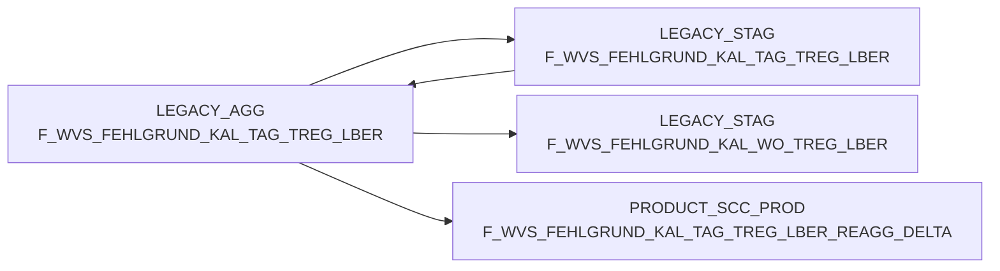

# F_WVS_FEHLGRUND_KAL_TAG_TREG_LBER (Table)

## Table Description

The **BDWH_SCCWVS** application is a comprehensive **Waren-Versorgungs-Statistik (WVS)** system that processes and analyzes supply chain statistics for retail operations. This application builds a parallel environment to replace the legacy LEGACY_DWH system within PRODUCT_SCC_PROD.

The table serves as an **aggregated fact table** that consolidates supply shortage reasons (**Fehlgründe**) at the daily level (**KAL_TAG**) grouped by trading regions and suppliers (**TREG_LBER**). It contains detailed metrics including order quantities, delivery quantities, shortage amounts, and associated monetary values across different pricing tiers (purchase, wholesale, retail).

This table is populated through a multi-step ETL process that:
- Extracts data from ELVS commissioning systems and ELAB sources
- Calculates delivery dates and supplier assignments
- Identifies WVS-relevant records and shortage reasons
- Aggregates detailed transaction data into daily summaries by region and supplier

The application processes supply chain events, tracks delivery performance, identifies shortage causes, and provides analytical insights for supply chain optimization. It supports both legacy ELVS data and new ELAB-based data sources, ensuring continuity during system migration.

## Lineage / Impact



## Statements

The following statements create/modify this table:

<Util>INSERT</Util> inside [BDWH_SCCWVS/sccwvs_500_wvs_aggregate.sas](../../Applications/BDWH_SCCWVS/sccwvs_500_wvs_aggregate.sas):
```sql:line-numbers
INSERT INTO PRODUCT_SCC_PROD.LEGACY_AGG.F_WVS_FEHLGRUND_KAL_TAG_TREG_LBER
SELECT
NAN_ART_ID,
MA_TREG_LBER_ID,
KAL_TAG_ID,
MA_LAG_ID,
LIEF_ID,
AKT_KZ,
WAEINH,
FEHL_ART_GRUND_ID,
SUM(BEST_MG),
SUM(BEST_W_EK_BTO),
SUM(BEST_W_WG_BTO),
SUM(BEST_W_VK_BTO),
SUM(FEHL_GRUND_MG),
SUM(FEHL_GRUND_W_EK_BTO),
SUM(FEHL_GRUND_W_WG_BTO),
SUM(FEHL_GRUND_W_VK_BTO),
WVS_RELEVANT,
LIEFMG_ANGEPASST
FROM PRODUCT_SCC_PROD.LEGACY_DWH.F_WVS_FEHLGRUND F
INNER JOIN LEGACY_DWH.DWH.LU_D_MA_HPT_ABT M
ON (F.MA_HPT_ABT_ID = M.MA_HPT_ABT_ID)
WHERE
F.KAL_TAG_ID IN (SELECT DISTINCT KAL_TAG_ID
FROM PRODUCT_SCC_PROD.LEGACY_STAG.F_WVS_FEHLGRUND_TAGE)
GROUP BY
NAN_ART_ID,
MA_TREG_LBER_ID,
KAL_TAG_ID,
MA_LAG_ID,
LIEF_ID,
AKT_KZ,
WAEINH,
FEHL_ART_GRUND_ID,
WVS_RELEVANT,
LIEFMG_ANGEPASST
```

## References

The table F_WVS_FEHLGRUND_KAL_TAG_TREG_LBER is used in the following SAS programs:

| Application | SAS Program |
|---|---|
| [BDWH_SCCWVS](../../Applications/BDWH_SCCWVS) | [sccwvs_500_wvs_aggregate.sas](../../Applications/BDWH_SCCWVS/sccwvs_500_wvs_aggregate.sas) |
## Table Schema

| Field Name | Datatype | Precision | Scale | Is Nullable | Constraint | Description |
|---|---|---|---|---|---|---|
| NAN_ART_ID | NUMBER | 9 | 0 | TRUE |   | Article ID from NAN system |
| MA_TREG_LBER_ID | NUMBER | 12 | 0 | TRUE |   | Market region delivery area ID |
| KAL_TAG_ID | DATE |  |  | TRUE |   | Calendar day ID |
| MA_LAG_ID | NUMBER | 10 | 0 | TRUE |   | Market warehouse ID |
| LIEF_ID | VARCHAR | 6 | 0 | TRUE |   | Supplier ID |
| AKT_KZ | VARCHAR | 1 | 0 | TRUE |   | Action indicator |
| WAEINH | NUMBER | 6 | 0 | TRUE |   | Goods unit |
| FEHL_ART_GRUND_ID | NUMBER | 7 | 0 | TRUE |   | Shortage reason ID |
| BEST_MG | NUMBER | 12 | 3 | TRUE |   | Order quantity |
| BEST_W_EK_BTO | NUMBER | 12 | 3 | TRUE |   | Order value purchase price gross |
| BEST_W_WG_BTO | NUMBER | 12 | 3 | TRUE |   | Order value goods price gross |
| BEST_W_VK_BTO | NUMBER | 12 | 3 | TRUE |   | Order value sales price gross |
| FEHL_GRUND_MG | NUMBER | 12 | 3 | TRUE |   | Shortage reason quantity |
| FEHL_GRUND_W_EK_BTO | NUMBER | 12 | 3 | TRUE |   | Shortage reason value purchase price gross |
| FEHL_GRUND_W_WG_BTO | NUMBER | 12 | 3 | TRUE |   | Shortage reason value goods price gross |
| FEHL_GRUND_W_VK_BTO | NUMBER | 12 | 3 | TRUE |   | Shortage reason value sales price gross |
| WVS_RELEVANT | NUMBER | 2 | 0 | TRUE |   | WVS relevance indicator |
| LIEFMG_ANGEPASST | NUMBER | 2 | 0 | TRUE |   | Delivery quantity adjusted indicator |