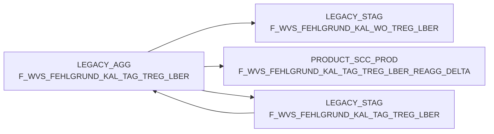

# F_WVS_FEHLGRUND_KAL_TAG_TREG_LBER (Table)

## Table Description

_No description available_

## Lineage / Impact

## References

The table F_WVS_FEHLGRUND_KAL_TAG_TREG_LBER is used in the following SAS programs:

| Application | SAS Program |
|---|---|
| [BDWH_SCCWVS](../../Applications/BDWH_SCCWVS) | [sccwvs_500_wvs_aggregate.sas](../../Applications/BDWH_SCCWVS/sccwvs_500_wvs_aggregate.sas) |
## Table Schema

| Field Name | Datatype | Precision | Scale | Is Nullable | Constraint | Description |
|---|---|---|---|---|---|---|
| NAN_ART_ID | NUMBER | 9 | 0 | TRUE |   | Article ID from NAN system |
| MA_TREG_LBER_ID | NUMBER | 12 | 0 | TRUE |   | Market region delivery area ID |
| KAL_TAG_ID | DATE |  |  | TRUE |   | Calendar day ID |
| MA_LAG_ID | NUMBER | 10 | 0 | TRUE |   | Market warehouse ID |
| LIEF_ID | VARCHAR | 6 | 0 | TRUE |   | Supplier ID |
| AKT_KZ | VARCHAR | 1 | 0 | TRUE |   | Action indicator |
| WAEINH | NUMBER | 6 | 0 | TRUE |   | Goods unit |
| FEHL_ART_GRUND_ID | NUMBER | 7 | 0 | TRUE |   | Shortage reason ID |
| BEST_MG | NUMBER | 12 | 3 | TRUE |   | Order quantity |
| BEST_W_EK_BTO | NUMBER | 12 | 3 | TRUE |   | Order value purchase price gross |
| BEST_W_WG_BTO | NUMBER | 12 | 3 | TRUE |   | Order value goods price gross |
| BEST_W_VK_BTO | NUMBER | 12 | 3 | TRUE |   | Order value sales price gross |
| FEHL_GRUND_MG | NUMBER | 12 | 3 | TRUE |   | Shortage reason quantity |
| FEHL_GRUND_W_EK_BTO | NUMBER | 12 | 3 | TRUE |   | Shortage reason value purchase price gross |
| FEHL_GRUND_W_WG_BTO | NUMBER | 12 | 3 | TRUE |   | Shortage reason value goods price gross |
| FEHL_GRUND_W_VK_BTO | NUMBER | 12 | 3 | TRUE |   | Shortage reason value sales price gross |
| WVS_RELEVANT | NUMBER | 2 | 0 | TRUE |   | WVS relevance indicator |
| LIEFMG_ANGEPASST | NUMBER | 2 | 0 | TRUE |   | Delivery quantity adjusted indicator |