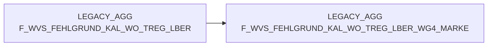

# F_WVS_FEHLGRUND_KAL_WO_TREG_LBER (Table)

## Table Description

The **BDWH_SCCWVS** application is a comprehensive **Waren-Versorgungs-Statistik (WVS)** system that processes and analyzes supply chain statistics for retail operations. This application builds a parallel environment to replace the legacy LEGACY_DWH system within PRODUCT_SCC_PROD.

The table stores **weekly aggregated supply shortage data** grouped by trading region and warehouse (*KAL_WO_TREG_LBER*). It contains consolidated metrics including order quantities, delivery amounts, shortage reasons, and financial values aggregated at the calendar week level. The data supports supply chain analysis by providing insights into delivery performance, shortage patterns, and supplier reliability across different warehouse locations and trading regions.

This aggregated table is generated through a multi-step ETL process that processes ELAB-sourced data (post-ELVS core replacement), calculates shortage reasons, determines suppliers, and creates time-based aggregations. The system processes data for the last 21 days with daily recalculations to ensure accuracy and supports both regular operations and action week scenarios for comprehensive supply chain monitoring.

## Lineage / Impact



## Statements

The following statements create/modify this table:

<Util>INSERT</Util> inside [BDWH_SCCWVS/sccwvs_500_wvs_aggregate.sas](../../Applications/BDWH_SCCWVS/sccwvs_500_wvs_aggregate.sas):
```sql:line-numbers
DELETE FROM PRODUCT_SCC_PROD.LEGACY_STAG.F_WVS_FEHLGRUND_KAL_WO_TREG_LBER

INSERT INTO PRODUCT_SCC_PROD.LEGACY_STAG.F_WVS_FEHLGRUND_KAL_WO_TREG_LBER SELECT
NAN_ART_ID,
MA_TREG_LBER_ID,
KAL_WO_ID,
MA_LAG_ID,
LIEF_ID,
AKT_KZ,
WAEINH,
FEHL_ART_GRUND_ID,
SUM(BEST_MG),
SUM(BEST_W_EK_BTO),
SUM(BEST_W_WG_BTO),
SUM(BEST_W_VK_BTO),
SUM(FEHL_GRUND_MG),
SUM(FEHL_GRUND_W_EK_BTO),
SUM(FEHL_GRUND_W_WG_BTO),
SUM(FEHL_GRUND_W_VK_BTO),
WVS_RELEVANT,
LIEFMG_ANGEPASST
FROM PRODUCT_SCC_PROD.LEGACY_AGG.F_WVS_FEHLGRUND_KAL_TAG_TREG_LBER F
INNER JOIN LEGACY_DWH.DWH.LU_D_KAL_TAG T
ON (F.KAL_TAG_ID = T.KAL_TAG_ID)
WHERE
T.KAL_WO_ID IN (SELECT DISTINCT KAL_WO_ID
FROM PRODUCT_SCC_PROD.LEGACY_STAG.F_WVS_FEHLGRUND_TAGE)
GROUP BY
NAN_ART_ID,
MA_TREG_LBER_ID,
KAL_WO_ID,
MA_LAG_ID,
LIEF_ID,
AKT_KZ,
WAEINH,
FEHL_ART_GRUND_ID,
WVS_RELEVANT,
LIEFMG_ANGEPASST

DELETE FROM PRODUCT_SCC_PROD.LEGACY_AGG.F_WVS_FEHLGRUND_KAL_WO_TREG_LBER
WHERE
KAL_WO_ID IN (SELECT DISTINCT KAL_WO_ID
FROM PRODUCT_SCC_PROD.LEGACY_STAG.F_WVS_FEHLGRUND_TAGE)

INSERT INTO PRODUCT_SCC_PROD.LEGACY_AGG.F_WVS_FEHLGRUND_KAL_WO_TREG_LBER
SELECT *
FROM PRODUCT_SCC_PROD.LEGACY_STAG.F_WVS_FEHLGRUND_KAL_WO_TREG_LBER
```

## References

The table F_WVS_FEHLGRUND_KAL_WO_TREG_LBER is used in the following SAS programs:

| Application | SAS Program |
|---|---|
| [BDWH_SCCWVS](../../Applications/BDWH_SCCWVS) | [sccwvs_500_wvs_aggregate.sas](../../Applications/BDWH_SCCWVS/sccwvs_500_wvs_aggregate.sas) |
## Table Schema

| Field Name | Datatype | Precision | Scale | Is Nullable | Constraint | Description |
|---|---|---|---|---|---|---|
| NAN_ART_ID | NUMBER | 9 | 0 | TRUE |   | Artikel-ID |
| MA_TREG_LBER_ID | NUMBER | 10 | 0 | TRUE |   | Markt-Traditionsregion-Lieferbereich-ID |
| KAL_WO_ID | NUMBER | 8 | 0 | TRUE |   | Kalender-Wochen-ID |
| MA_LAG_ID | NUMBER | 10 | 0 | TRUE |   | Markt-Lager-ID |
| LIEF_ID | VARCHAR | 6 | 0 | TRUE |   | Lieferanten-ID |
| AKT_KZ | VARCHAR | 1 | 0 | TRUE |   | Aktions-Kennzeichen |
| WAEINH | NUMBER | 6 | 0 | TRUE |   | Wareneinheit |
| FEHL_ART_GRUND_ID | NUMBER | 7 | 0 | TRUE |   | Fehlgrund-ID |
| BEST_MG | NUMBER | 12 | 3 | TRUE |   | Bestellmenge |
| BEST_W_EK_BTO | NUMBER | 12 | 3 | TRUE |   | Bestellwert Einkauf brutto |
| BEST_W_WG_BTO | NUMBER | 12 | 3 | TRUE |   | Bestellwert Warengruppe brutto |
| BEST_W_VK_BTO | NUMBER | 12 | 3 | TRUE |   | Bestellwert Verkauf brutto |
| FEHL_GRUND_MG | NUMBER | 12 | 3 | TRUE |   | Fehlgrund-Menge |
| FEHL_GRUND_W_EK_BTO | NUMBER | 12 | 3 | TRUE |   | Fehlgrund-Wert Einkauf brutto |
| FEHL_GRUND_W_WG_BTO | NUMBER | 12 | 3 | TRUE |   | Fehlgrund-Wert Warengruppe brutto |
| FEHL_GRUND_W_VK_BTO | NUMBER | 12 | 3 | TRUE |   | Fehlgrund-Wert Verkauf brutto |
| WVS_RELEVANT | NUMBER | 2 | 0 | TRUE |   | WVS-Relevanz-Kennzeichen |
| LIEFMG_ANGEPASST | NUMBER | 2 | 0 | TRUE |   | Liefermenge-angepasst-Kennzeichen |