# F_WVS_FEHLGRUND_KAL_WO_TREG_LBER_WG4_MARKE (Table)

## Table Description

_No description available_

## Table Schema

| Field Name | Datatype | Precision | Scale | Is Nullable | Constraint | Description |
|---|---|---|---|---|---|---|
| WG4_MARKE_ID | INTEGER | NULL | NULL | TRUE | Constraint | Product group 4 brand identifier |
| MA_TREG_LBER_ID | INTEGER | NULL | NULL | TRUE | Constraint | Market area regional delivery area identifier |
| KAL_WO_ID | INTEGER | NULL | NULL | TRUE | Constraint | Calendar week identifier |
| MA_LAG_ID | INTEGER | NULL | NULL | TRUE | Constraint | Market area warehouse identifier |
| LIEF_ID | VARCHAR | 6 | NULL | TRUE | Constraint | Supplier identifier |
| AKT_KZ | VARCHAR | 1 | NULL | TRUE | Constraint | Action indicator flag |
| WAEINH | INTEGER | NULL | NULL | TRUE | Constraint | Goods unit identifier |
| FEHL_ART_GRUND_ID | INTEGER | NULL | NULL | TRUE | Constraint | Shortage reason type identifier |
| BEST_MG | DECIMAL | 12 | 3 | TRUE | Constraint | Order quantity |
| BEST_W_EK_BTO | DECIMAL | 12 | 3 | TRUE | Constraint | Order value purchase price gross |
| BEST_W_WG_BTO | DECIMAL | 12 | 3 | TRUE | Constraint | Order value goods price gross |
| BEST_W_VK_BTO | DECIMAL | 12 | 3 | TRUE | Constraint | Order value sales price gross |
| FEHL_GRUND_MG | DECIMAL | 12 | 3 | TRUE | Constraint | Shortage reason quantity |
| FEHL_GRUND_W_EK_BTO | DECIMAL | 12 | 3 | TRUE | Constraint | Shortage reason value purchase price gross |
| FEHL_GRUND_W_WG_BTO | DECIMAL | 12 | 3 | TRUE | Constraint | Shortage reason value goods price gross |
| FEHL_GRUND_W_VK_BTO | DECIMAL | 12 | 3 | TRUE | Constraint | Shortage reason value sales price gross |
| WVS_RELEVANT | INTEGER | NULL | NULL | TRUE | Constraint | WVS relevance indicator |
| LIEFMG_ANGEPASST | INTEGER | NULL | NULL | TRUE | Constraint | Delivery quantity adjusted indicator |
## Lineage / Impact

```mermaid
%%{init: {'flowchart': { 'nodeSpacing': 10, 'rankSpacing': 40, 'rankdir': 'TB' }}}%%

flowchart LR

  DWH.LU_D_NAN_ART["DWH<br/>LU_D_NAN_ART"] --> LEGACY_AGG.F_WVS_FEHLGRUND_KAL_WO_TREG_LBER_WG4_MARKE["LEGACY_AGG<br/>F_WVS_FEHLGRUND_KAL_WO_TREG_LBER_WG4_MARKE"]
  LEGACY_STAG.F_WVS_FEHLGRUND_KAL_WO_TREG_LBER_WG4_MARKE["LEGACY_STAG<br/>F_WVS_FEHLGRUND_KAL_WO_TREG_LBER_WG4_MARKE"] --> LEGACY_AGG.F_WVS_FEHLGRUND_KAL_WO_TREG_LBER_WG4_MARKE["LEGACY_AGG<br/>F_WVS_FEHLGRUND_KAL_WO_TREG_LBER_WG4_MARKE"]
  LEGACY_AGG.F_WVS_FEHLGRUND_KAL_WO_TREG_LBER_WG4_MARKE["LEGACY_AGG<br/>F_WVS_FEHLGRUND_KAL_WO_TREG_LBER_WG4_MARKE"] --> LEGACY_STAG.F_WVS_FEHLGRUND_KAL_WO_TREG_LBER_WG4_MARKE["LEGACY_STAG<br/>F_WVS_FEHLGRUND_KAL_WO_TREG_LBER_WG4_MARKE"]
  LEGACY_AGG.F_WVS_FEHLGRUND_KAL_WO_TREG_LBER["LEGACY_AGG<br/>F_WVS_FEHLGRUND_KAL_WO_TREG_LBER"] --> LEGACY_AGG.F_WVS_FEHLGRUND_KAL_WO_TREG_LBER_WG4_MARKE["LEGACY_AGG<br/>F_WVS_FEHLGRUND_KAL_WO_TREG_LBER_WG4_MARKE"]
  click DWH.LU_D_NAN_ART "../../tables/DWH/LU_D_NAN_ART"
  click LEGACY_STAG.F_WVS_FEHLGRUND_KAL_WO_TREG_LBER_WG4_MARKE "../../tables/LEGACY_STAG/F_WVS_FEHLGRUND_KAL_WO_TREG_LBER_WG4_MARKE"
  click LEGACY_AGG.F_WVS_FEHLGRUND_KAL_WO_TREG_LBER_WG4_MARKE "../../tables/LEGACY_AGG/F_WVS_FEHLGRUND_KAL_WO_TREG_LBER_WG4_MARKE"
  click LEGACY_AGG.F_WVS_FEHLGRUND_KAL_WO_TREG_LBER "../../tables/LEGACY_AGG/F_WVS_FEHLGRUND_KAL_WO_TREG_LBER"
  click LEGACY_AGG.F_WVS_FEHLGRUND_KAL_WO_TREG_LBER_WG4_MARKE "../../tables/LEGACY_AGG/F_WVS_FEHLGRUND_KAL_WO_TREG_LBER_WG4_MARKE"
  click LEGACY_AGG.F_WVS_FEHLGRUND_KAL_WO_TREG_LBER_WG4_MARKE "../../tables/LEGACY_AGG/F_WVS_FEHLGRUND_KAL_WO_TREG_LBER_WG4_MARKE"
  click LEGACY_STAG.F_WVS_FEHLGRUND_KAL_WO_TREG_LBER_WG4_MARKE "../../tables/LEGACY_STAG/F_WVS_FEHLGRUND_KAL_WO_TREG_LBER_WG4_MARKE"
  click LEGACY_AGG.F_WVS_FEHLGRUND_KAL_WO_TREG_LBER_WG4_MARKE "../../tables/LEGACY_AGG/F_WVS_FEHLGRUND_KAL_WO_TREG_LBER_WG4_MARKE"
```

