# F_WVS_FEHLGRUND_KAL_WO_TREG_LBER_WG4_MARKE (Table)

## Table Description

**BDWH_SCCWVS** is a **Waren-Versorgungs-Statistik (WVS)** application that builds a parallel environment to replace the legacy DWH system in PRODUCT_SCC_PROD. This application processes supply chain statistics by analyzing delivery shortages and their underlying causes.

The table stores **weekly aggregated shortage reason data** grouped by **product brand categories (WG4_MARKE)** and **regional delivery areas (TREG_LBER)**. It contains calculated shortage quantities and values with their corresponding reasons, supporting supply chain analysis and reporting at a weekly granularity.

Key features include:
- **Weekly aggregation** of shortage data by brand and region
- **Multi-dimensional analysis** across product categories, suppliers, and locations
- **Financial metrics** including purchase, goods, and sales values
- **Relevance indicators** for WVS reporting and adjusted delivery quantities

This table is part of the **aggregation layer** that consolidates detailed shortage transactions into meaningful business metrics for supply chain management and performance monitoring.

## Lineage / Impact

```mermaid
%%{init: {'flowchart': { 'nodeSpacing': 10, 'rankSpacing': 40, 'rankdir': 'TB' }}}%%

flowchart LR

  LEGACY_AGG.F_WVS_FEHLGRUND_KAL_WO_TREG_LBER["LEGACY_AGG<br/>F_WVS_FEHLGRUND_KAL_WO_TREG_LBER"] --> LEGACY_AGG.F_WVS_FEHLGRUND_KAL_WO_TREG_LBER_WG4_MARKE["LEGACY_AGG<br/>F_WVS_FEHLGRUND_KAL_WO_TREG_LBER_WG4_MARKE"]
  DWH.LU_D_NAN_ART["DWH<br/>LU_D_NAN_ART"] --> LEGACY_AGG.F_WVS_FEHLGRUND_KAL_WO_TREG_LBER_WG4_MARKE["LEGACY_AGG<br/>F_WVS_FEHLGRUND_KAL_WO_TREG_LBER_WG4_MARKE"]
  LEGACY_AGG.F_WVS_FEHLGRUND_KAL_WO_TREG_LBER_WG4_MARKE["LEGACY_AGG<br/>F_WVS_FEHLGRUND_KAL_WO_TREG_LBER_WG4_MARKE"] --> LEGACY_STAG.F_WVS_FEHLGRUND_KAL_WO_TREG_LBER_WG4_MARKE["LEGACY_STAG<br/>F_WVS_FEHLGRUND_KAL_WO_TREG_LBER_WG4_MARKE"]
  LEGACY_STAG.F_WVS_FEHLGRUND_KAL_WO_TREG_LBER_WG4_MARKE["LEGACY_STAG<br/>F_WVS_FEHLGRUND_KAL_WO_TREG_LBER_WG4_MARKE"] --> LEGACY_AGG.F_WVS_FEHLGRUND_KAL_WO_TREG_LBER_WG4_MARKE["LEGACY_AGG<br/>F_WVS_FEHLGRUND_KAL_WO_TREG_LBER_WG4_MARKE"]
  click LEGACY_AGG.F_WVS_FEHLGRUND_KAL_WO_TREG_LBER "../../tables/LEGACY_AGG/F_WVS_FEHLGRUND_KAL_WO_TREG_LBER"
  click DWH.LU_D_NAN_ART "../../tables/DWH/LU_D_NAN_ART"
  click LEGACY_AGG.F_WVS_FEHLGRUND_KAL_WO_TREG_LBER_WG4_MARKE "../../tables/LEGACY_AGG/F_WVS_FEHLGRUND_KAL_WO_TREG_LBER_WG4_MARKE"
  click LEGACY_STAG.F_WVS_FEHLGRUND_KAL_WO_TREG_LBER_WG4_MARKE "../../tables/LEGACY_STAG/F_WVS_FEHLGRUND_KAL_WO_TREG_LBER_WG4_MARKE"
  click LEGACY_AGG.F_WVS_FEHLGRUND_KAL_WO_TREG_LBER_WG4_MARKE "../../tables/LEGACY_AGG/F_WVS_FEHLGRUND_KAL_WO_TREG_LBER_WG4_MARKE"
  click LEGACY_AGG.F_WVS_FEHLGRUND_KAL_WO_TREG_LBER_WG4_MARKE "../../tables/LEGACY_AGG/F_WVS_FEHLGRUND_KAL_WO_TREG_LBER_WG4_MARKE"
  click LEGACY_STAG.F_WVS_FEHLGRUND_KAL_WO_TREG_LBER_WG4_MARKE "../../tables/LEGACY_STAG/F_WVS_FEHLGRUND_KAL_WO_TREG_LBER_WG4_MARKE"
  click LEGACY_AGG.F_WVS_FEHLGRUND_KAL_WO_TREG_LBER_WG4_MARKE "../../tables/LEGACY_AGG/F_WVS_FEHLGRUND_KAL_WO_TREG_LBER_WG4_MARKE"
```



## Statements

The following statements create/modify this table:

<Util>INSERT</Util> inside [BDWH_SCCWVS/sccwvs_500_wvs_aggregate.sas](../../Applications/BDWH_SCCWVS/sccwvs_500_wvs_aggregate.sas):
```sql:line-numbers
INSERT INTO PRODUCT_SCC_PROD.LEGACY_AGG.F_WVS_FEHLGRUND_KAL_WO_TREG_LBER_WG4_MARKE SELECT WG4_MARKE_ID, MA_TREG_LBER_ID, KAL_WO_ID, MA_LAG_ID, LIEF_ID, AKT_KZ, WAEINH, FEHL_ART_GRUND_ID, SUM(BEST_MG), SUM(BEST_W_EK_BTO), SUM(BEST_W_WG_BTO), SUM(BEST_W_VK_BTO), SUM(FEHL_GRUND_MG), SUM(FEHL_GRUND_W_EK_BTO), SUM(FEHL_GRUND_W_WG_BTO), SUM(FEHL_GRUND_W_VK_BTO), WVS_RELEVANT, LIEFMG_ANGEPASST FROM PRODUCT_SCC_PROD.LEGACY_AGG.F_WVS_FEHLGRUND_KAL_WO_TREG_LBER F INNER JOIN LEGACY_DWH.DWH.LU_D_NAN_ART M ON (F.NAN_ART_ID = M.NAN_ART_ID) WHERE F.KAL_WO_ID IN (SELECT DISTINCT KAL_WO_ID FROM PRODUCT_SCC_PROD.LEGACY_STAG.F_WVS_FEHLGRUND_TAGE) GROUP BY WG4_MARKE_ID, MA_TREG_LBER_ID, KAL_WO_ID, MA_LAG_ID, LIEF_ID, AKT_KZ, WAEINH, FEHL_ART_GRUND_ID, WVS_RELEVANT, LIEFMG_ANGEPASST
```

## References

The table F_WVS_FEHLGRUND_KAL_WO_TREG_LBER_WG4_MARKE is used in the following SAS programs:

| Application | SAS Program |
|---|---|
| [BDWH_SCCWVS](../../Applications/BDWH_SCCWVS) | [sccwvs_500_wvs_aggregate.sas](../../Applications/BDWH_SCCWVS/sccwvs_500_wvs_aggregate.sas) |
## Table Schema

| Field Name | Datatype | Precision | Scale | Is Nullable | Constraint | Description |
|---|---|---|---|---|---|---|
| WG4_MARKE_ID | INTEGER | NULL | NULL | TRUE |   | Product group 4 brand identifier |
| MA_TREG_LBER_ID | INTEGER | NULL | NULL | TRUE |   | Market area regional delivery area identifier |
| KAL_WO_ID | INTEGER | NULL | NULL | TRUE |   | Calendar week identifier |
| MA_LAG_ID | INTEGER | NULL | NULL | TRUE |   | Market area warehouse identifier |
| LIEF_ID | VARCHAR | 6 | NULL | TRUE |   | Supplier identifier |
| AKT_KZ | VARCHAR | 1 | NULL | TRUE |   | Action indicator flag |
| WAEINH | INTEGER | NULL | NULL | TRUE |   | Goods unit identifier |
| FEHL_ART_GRUND_ID | INTEGER | NULL | NULL | TRUE |   | Shortage reason type identifier |
| BEST_MG | DECIMAL | 12 | 3 | TRUE |   | Order quantity |
| BEST_W_EK_BTO | DECIMAL | 12 | 3 | TRUE |   | Order value purchase price gross |
| BEST_W_WG_BTO | DECIMAL | 12 | 3 | TRUE |   | Order value goods price gross |
| BEST_W_VK_BTO | DECIMAL | 12 | 3 | TRUE |   | Order value sales price gross |
| FEHL_GRUND_MG | DECIMAL | 12 | 3 | TRUE |   | Shortage reason quantity |
| FEHL_GRUND_W_EK_BTO | DECIMAL | 12 | 3 | TRUE |   | Shortage reason value purchase price gross |
| FEHL_GRUND_W_WG_BTO | DECIMAL | 12 | 3 | TRUE |   | Shortage reason value goods price gross |
| FEHL_GRUND_W_VK_BTO | DECIMAL | 12 | 3 | TRUE |   | Shortage reason value sales price gross |
| WVS_RELEVANT | INTEGER | NULL | NULL | TRUE |   | WVS relevance indicator |
| LIEFMG_ANGEPASST | INTEGER | NULL | NULL | TRUE |   | Delivery quantity adjusted indicator |