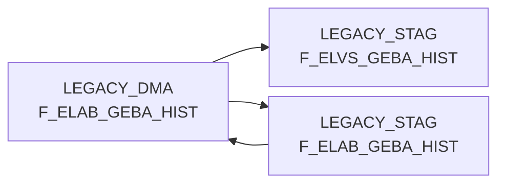

# F_ELAB_GEBA_HIST (Table)

## Table Description

**F_ELAB_GEBA_HIST** is a historical data table within the **BDWH_ELABGEBA** application that supports the **ELVS core replacement** initiative. This table serves as the historical repository for container unit data (Gebindeeinheit-Daten) from goods outbound processes.

The application **merges legacy ELVS GEBA data with new ELISA data sources**, specifically combining XML messages from ELISA article warehouse supply containing logistic factors and stockkeeping units. The table maintains historical versions of container unit records with **temporal validity tracking** through GUELT_VON and GUELT_BIS fields.

**Key features include:**
- Historical preservation of container unit master data
- **Dual data source integration** (legacy ELVS and new ELISA systems)
- Temporal data management with validity periods
- **Source tracking** via HERKUNFT_BASIS field (ELVS/ELAB)
- Physical dimension storage (length, width, height, volume)
- Weight and packaging specifications

The table supports **data warehouse views** that must be redirected from legacy ELVS tables to these new DMA tables post-migration. Processing occurs through a **three-stage ETL pipeline** (DW013803-DW013805) that consolidates data, applies historical logic, and maintains data lineage for downstream analytical processes.

## Lineage / Impact



## Statements

The following statements create/modify this table:

<Util>INSERT</Util> inside [BDWH_ELABGEBA/snow_elabgeba_200_nach_dma.sas](../../Applications/BDWH_ELABGEBA/snow_elabgeba_200_nach_dma.sas):
```sql:line-numbers
delete from PRODUCT_LSP_LEGACY_PROD.LEGACY_DMA.F_ELAB_GEBA_HIST
insert into PRODUCT_LSP_LEGACY_PROD.LEGACY_DMA.F_ELAB_GEBA_HIST select * from PRODUCT_LSP_LEGACY_PROD.LEGACY_STAG.F_ELAB_GEBA_HIST
```

## References

The table F_ELAB_GEBA_HIST is used in the following SAS programs:

| Application | SAS Program |
|---|---|
| [BDWH_ELABGEBA](../../Applications/BDWH_ELABGEBA) | [snow_elabgeba_200_nach_dma.sas](../../Applications/BDWH_ELABGEBA/snow_elabgeba_200_nach_dma.sas) |
| [BDWH_ELABGEBA](../../Applications/BDWH_ELABGEBA) | [snow_elabgeba_100_geba_artlag_zusammenf.sas](../../Applications/BDWH_ELABGEBA/snow_elabgeba_100_geba_artlag_zusammenf.sas) |
## Table Schema

| Field Name | Datatype | Precision | Scale | Is Nullable | Constraint | Description |
|---|---|---|---|---|---|---|
| MA_LAG_ID | INTEGER |  |  | FALSE | PRIMARY KEY | Material warehouse ID |
| LAGNR | VARCHAR | 3 |  | FALSE | PRIMARY KEY | Warehouse number |
| NAN_ART_ID | INTEGER |  |  | FALSE | PRIMARY KEY | Article ID |
| AKT_KZ | VARCHAR | 1 |  | FALSE | PRIMARY KEY | Activity indicator |
| WAEINH | VARCHAR | 10 |  | FALSE | PRIMARY KEY | Goods issue unit |
| LOKAL_KZ | VARCHAR | 1 |  | TRUE |   | Local indicator |
| ZUSATZTEXT | VARCHAR | 255 |  | TRUE |   | Additional text |
| HKLASSE | VARCHAR | 10 |  | TRUE |   | Hazard class |
| UPDKZ | VARCHAR | 1 |  | TRUE |   | Update indicator |
| GUEVDAT | DATE |  |  | TRUE |   | Valid from date |
| GUEBDAT | DATE |  |  | TRUE |   | Valid to date |
| GEFAHRENGUT_KZ | VARCHAR | 1 |  | TRUE |   | Dangerous goods indicator |
| LAGSTRKZ | VARCHAR | 10 |  | TRUE |   | Storage structure indicator |
| VPEINH | VARCHAR | 10 |  | TRUE |   | Packaging unit |
| GEWICHT | DECIMAL | 15 | 3 | TRUE |   | Weight |
| UPDDAT | DATE |  |  | TRUE |   | Update date |
| LAENGE | DECIMAL | 15 | 3 | TRUE |   | Length in mm |
| BREITE | DECIMAL | 15 | 3 | TRUE |   | Width in mm |
| HOEHE | DECIMAL | 15 | 3 | TRUE |   | Height in mm |
| VOLUMEN | DECIMAL | 15 | 9 | TRUE |   | Volume in m3 |
| BRUTTO_GEWICHT | DECIMAL | 15 | 3 | TRUE |   | Gross weight |
| PAL_HOEHE | DECIMAL | 15 | 3 | TRUE |   | Pallet height |
| ERZ_LAND | VARCHAR | 3 |  | TRUE |   | Country of origin |
| TARA_KG | DECIMAL | 15 | 3 | TRUE |   | Tare weight in kg |
| TARA_PROZ | DECIMAL | 5 | 2 | TRUE |   | Tare percentage |
| ANZ_JE_ROLLC | INTEGER |  |  | TRUE |   | Quantity per roll container |
| RAEUMDAT | DATE |  |  | TRUE |   | Clearing date |
| ZUGANGSDAT | DATE |  |  | TRUE |   | Access date |
| RESTLZ | INTEGER |  |  | TRUE |   | Remaining shelf life |
| VERFALLDAT | DATE |  |  | TRUE |   | Expiry date |
| CHEM_BEH | VARCHAR | 10 |  | TRUE |   | Chemical treatment |
| AENDDAT | DATE |  |  | TRUE |   | Change date |
| LAG_ID | INTEGER |  |  | TRUE |   | Warehouse ID |
| GUELT_VON | DATE |  |  | TRUE |   | Valid from |
| GUELT_BIS | DATE |  |  | TRUE |   | Valid until |
| ACTIVE | INTEGER |  |  | TRUE |   | Active flag |
| AKTUELL | INTEGER |  |  | TRUE |   | Current flag |
| HERKUNFT_BASIS | VARCHAR | 10 |  | TRUE |   | Source basis (ELAB or ELVS) |