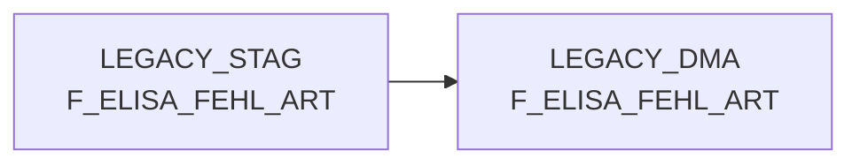

# F_ELISA_FEHL_ART (Table)

## Table Description

**DWELISAAUFTRAB** is a comprehensive data warehouse application that processes order completion messages from the ELISA system. The application handles XML-based order completion notifications (AuftragsabschlussmeldungV2) from pL-Store to ELISA, containing detailed information about commissioned quantities for all order positions.

The system processes order completion data through a **sequential job chain** consisting of 13 jobs (DWDW6449 through DW013912) that handle data movement, XML parsing, transformation, enrichment, and loading operations. Key processing steps include moving raw XML files from DFUE directories, parsing XML structures using specialized maps, transforming data with master data lookups, and enriching records with purchase and sales prices.

The application supports **multi-level position structures** where orders can contain 1-n WaNVE (outbound shipping units) and each WaNVE can contain 1-n articles. It handles complex scenarios including replacement articles, cancellation positions, and commissioning runs. The system includes comprehensive error handling, metadata tracking, and data archiving capabilities.

The final output table **F_ELISA_FEHL_ART** aggregates order completion data to match the structure of F_ELVS_FEHL_ART, providing consolidated information about ordered quantities, delivered quantities, shortage quantities, and various position-level attributes including pricing, weight, and logistics details. This enables supply chain cockpit reporting and analysis of order fulfillment performance across the REWE logistics network.

## Lineage / Impact



## Statements

The following statements create/modify this table:

<Util>MERGE</Util> inside [DWELISAAUFTRAB/snow_auftragsabschlussmeldung_fa_n_edw.sas](../../Applications/DWELISAAUFTRAB/snow_auftragsabschlussmeldung_fa_n_edw.sas):
```sql:line-numbers
merge into PRODUCT_SCC_PROD.LEGACY_DMA.F_ELISA_FEHL_ART ziel
using PRODUCT_SCC_PROD.LEGACY_STAG.F_ELISA_FEHL_ART quelle
on ziel.ma_lag_id = quelle.ma_lag_id and
ziel.nan_art_id = quelle.nan_art_id and
ziel.akt_kz = quelle.akt_kz and
ziel.kal_tag_id = quelle.kal_tag_id and
ziel.kopf_lifschn_nr = quelle.kopf_lifschn_nr and
ziel.pos_kst8_aufnr = quelle.pos_kst8_aufnr and
ziel.ma_hpt_abt_id = quelle.ma_hpt_abt_id and
ziel.pos_waeinh = quelle.pos_waeinh
when matched then
update set
BEST_MG = quelle.BEST_MG
, LIEF_MG = quelle.LIEF_MG
, FEHL_MG = quelle.FEHL_MG
, ERS_LIEF_MG = quelle.ERS_LIEF_MG
, ERS_FEHL_MG = quelle.ERS_FEHL_MG
, POS_LEERGUTKZ = quelle.POS_LEERGUTKZ
, POS_FRISCHEKZ = quelle.POS_FRISCHEKZ
, POS_KMMNG = quelle.POS_KMMNG
, POS_DIFFMNG = quelle.POS_DIFFMNG
, POS_GEWICHT = quelle.POS_GEWICHT
, LFD_NUMMER = quelle.LFD_NUMMER
, AUSLIEF_LAGNR = quelle.AUSLIEF_LAGNR
, LAGNR = quelle.LAGNR
, POS_WA_IST = quelle.POS_WA_IST
, POS_LADEGEWICHT = quelle.POS_LADEGEWICHT
, KOPF_LIFART = quelle.KOPF_LIFART
, LIF_NVE = quelle.LIF_NVE
, LIEF_ID = quelle.LIEF_ID
, POS_KV_URSACHE = quelle.POS_KV_URSACHE
, VK_BTO = quelle.VK_BTO
, VK_NTO = quelle.VK_NTO
, EINKAUFSPREIS = quelle.EINKAUFSPREIS
, POS_MWKZ = quelle.POS_MWKZ
, POS_KUERZ_KST_KZ = quelle.POS_KUERZ_KST_KZ
, POS_FEHLER_SCHL = quelle.POS_FEHLER_SCHL
when not matched then insert values
(
quelle.MA_LAG_ID
, quelle.NAN_ART_ID
, quelle.AKT_KZ
, quelle.MA_HPT_ABT_ID
, quelle.KAL_TAG_ID
, quelle.BEST_MG
, quelle.LIEF_MG
, quelle.FEHL_MG
, quelle.ERS_LIEF_MG
, quelle.ERS_FEHL_MG
, quelle.POS_LEERGUTKZ
, quelle.POS_FRISCHEKZ
, quelle.POS_WAEINH
, quelle.POS_KMMNG
, quelle.POS_DIFFMNG
, quelle.POS_GEWICHT
, quelle.LFD_NUMMER
, quelle.AUSLIEF_LAGNR
, quelle.LAGNR
, quelle.POS_WA_IST
, quelle.POS_LADEGEWICHT
, quelle.KOPF_LIFSCHN_NR
, quelle.KOPF_LIFART
, quelle.LIF_NVE
, quelle.LIEF_ID
, quelle.POS_KV_URSACHE
, quelle.POS_KST8_AUFNR
, quelle.VK_BTO
, quelle.VK_NTO
, quelle.EINKAUFSPREIS
, quelle.POS_MWKZ
, quelle.POS_KUERZ_KST_KZ
, quelle.POS_FEHLER_SCHL
)
```

## References

The table F_ELISA_FEHL_ART is used in the following SAS programs:

| Application | SAS Program |
|---|---|
| [DWELISAAUFTRAB](../../Applications/DWELISAAUFTRAB) | [snow_auftragsabschlussmeldung_fa_n_edw.sas](../../Applications/DWELISAAUFTRAB/snow_auftragsabschlussmeldung_fa_n_edw.sas) |
## Table Schema

| Field Name | Datatype | Precision | Scale | Is Nullable | Constraint | Description |
|---|---|---|---|---|---|---|
| MA_LAG_ID | NUMBER | 19 | 0 | FALSE | PRIMARY KEY | Market warehouse ID combining warehouse number and calendar date |
| NAN_ART_ID | NUMBER | 19 | 0 | FALSE | PRIMARY KEY | Article ID derived from NAN (National Article Number) and calendar date |
| AKT_KZ | VARCHAR | 1 | 0 | FALSE | PRIMARY KEY | Action indicator flag for promotional articles |
| MA_HPT_ABT_ID | NUMBER | 19 | 0 | FALSE | PRIMARY KEY | Market main department ID |
| KAL_TAG_ID | DATE | 0 | 0 | FALSE | PRIMARY KEY | Calendar date ID representing the planned delivery date |
| BEST_MG | NUMBER | 19 | 0 | TRUE |   | Ordered quantity in pieces |
| LIEF_MG | NUMBER | 19 | 0 | TRUE |   | Delivered quantity in pieces |
| FEHL_MG | NUMBER | 19 | 0 | TRUE |   | Missing quantity calculated as ordered minus delivered |
| ERS_LIEF_MG | NUMBER | 19 | 0 | TRUE |   | Replacement delivered quantity |
| ERS_FEHL_MG | NUMBER | 19 | 0 | TRUE |   | Replacement missing quantity |
| POS_LEERGUTKZ | VARCHAR | 1 | 0 | TRUE |   | Position empty container indicator |
| POS_FRISCHEKZ | VARCHAR | 1 | 0 | TRUE |   | Position fresh goods indicator |
| POS_WAEINH | NUMBER | 19 | 0 | FALSE | PRIMARY KEY | Position goods unit for packaging |
| POS_KMMNG | NUMBER | 19 | 0 | TRUE |   | Position commissioning quantity |
| POS_DIFFMNG | NUMBER | 19 | 0 | TRUE |   | Position difference quantity from order changes |
| POS_GEWICHT | NUMBER | 15 | 3 | TRUE |   | Position weight per piece in kg |
| LFD_NUMMER | NUMBER | 19 | 0 | TRUE |   | Sequential number from raw data processing |
| AUSLIEF_LAGNR | VARCHAR | 3 | 0 | TRUE |   | Outbound warehouse number |
| LAGNR | VARCHAR | 3 | 0 | TRUE |   | Warehouse number |
| POS_WA_IST | NUMBER | 19 | 0 | TRUE |   | Position actual goods quantity |
| POS_LADEGEWICHT | NUMBER | 19 | 0 | TRUE |   | Position loading weight |
| KOPF_LIFSCHN_NR | NUMBER | 19 | 0 | FALSE | PRIMARY KEY | Header delivery note number |
| KOPF_LIFART | VARCHAR | 2 | 0 | TRUE |   | Header delivery type |
| LIF_NVE | NUMBER | 19 | 0 | TRUE |   | Delivery NVE (shipping unit identifier) |
| LIEF_ID | VARCHAR | 6 | 0 | TRUE |   | Supplier ID |
| POS_KV_URSACHE | VARCHAR | 2 | 0 | TRUE |   | Position shortage reason code |
| POS_KST8_AUFNR | NUMBER | 19 | 0 | FALSE | PRIMARY KEY | Position cost center 8 order number |
| VK_BTO | NUMBER | 15 | 2 | TRUE |   | Sales price gross |
| VK_NTO | NUMBER | 15 | 2 | TRUE |   | Sales price net |
| EINKAUFSPREIS | NUMBER | 15 | 2 | TRUE |   | Purchase price |
| POS_MWKZ | VARCHAR | 1 | 0 | TRUE |   | Position VAT indicator |
| POS_KUERZ_KST_KZ | VARCHAR | 1 | 0 | TRUE |   | Position shortening cost indicator |
| POS_FEHLER_SCHL | VARCHAR | 4 | 0 | TRUE |   | Position error key |