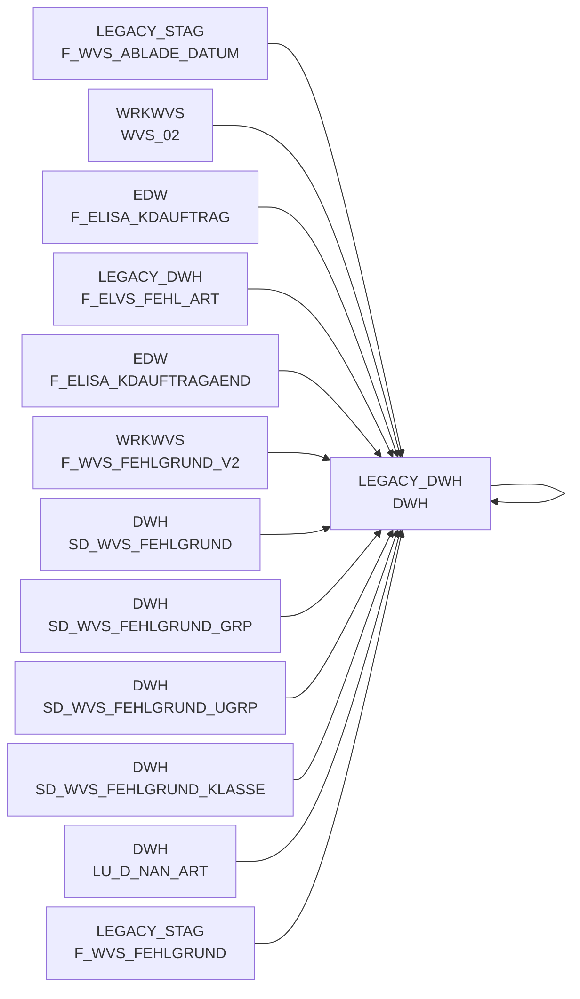

# DWH (Table)

## Table Description

_No description available_

## Lineage / Impact

## References

The table DWH is used in the following SAS programs:

| Application | SAS Program |
|---|---|
| [BDWH_SCCWVS](../../Applications/BDWH_SCCWVS) | [sccwvs_250_wvs_relevant.sas](../../Applications/BDWH_SCCWVS/sccwvs_250_wvs_relevant.sas) |
| [BDWH_SCCWVS](../../Applications/BDWH_SCCWVS) | [sccwvs_020_wvs_berechnen_elab.sas](../../Applications/BDWH_SCCWVS/sccwvs_020_wvs_berechnen_elab.sas) |
| [BDWH_SCCWVS](../../Applications/BDWH_SCCWVS) | [sccwvs_400_fakt_n_dwh.sas](../../Applications/BDWH_SCCWVS/sccwvs_400_fakt_n_dwh.sas) |
## Table Schema

| Field Name | Datatype | Precision | Scale | Is Nullable | Constraint | Description |
|---|---|---|---|---|---|---|
| NAN_ART_ID | NUMBER | 9 | 0 | TRUE |   | Article ID - Unique identifier for articles |
| MA_HPT_ABT_ID | NUMBER | 12 | 0 | TRUE |   | Main department ID - Identifier for main department |
| KAL_TAG_ID | DATE |  |  | TRUE |   | Calendar day ID - Date identifier for the transaction |
| MA_LAG_ID | NUMBER | 10 | 0 | TRUE |   | Warehouse ID - Identifier for warehouse location |
| AKT_KZ | VARCHAR | 1 |  | TRUE |   | Action indicator - Flag for promotional articles |
| WAEINH | NUMBER | 6 | 0 | TRUE |   | Unit of measure - Packaging unit identifier |
| LAGNR | VARCHAR | 3 |  | TRUE |   | Warehouse number - Short warehouse identifier |
| REFNR | NUMBER | 11 | 0 | TRUE |   | Reference number - Order reference identifier |
| POS_REFNR_LFDNR | NUMBER | 6 | 0 | TRUE |   | Position reference sequence number |
| FEHL_ART_GRUND_ID | NUMBER | 7 | 0 | TRUE |   | Shortage reason ID - Identifier for shortage cause |
| BEST_MG | NUMBER | 12 | 3 | TRUE |   | Order quantity - Ordered amount |
| BEST_W_EK_BTO | NUMBER | 12 | 3 | TRUE |   | Order value purchase price gross |
| BEST_W_WG_BTO | NUMBER | 12 | 3 | TRUE |   | Order value goods price gross |
| BEST_W_VK_BTO | NUMBER | 12 | 3 | TRUE |   | Order value sales price gross |
| FEHL_GRUND_MG | NUMBER | 12 | 3 | TRUE |   | Shortage quantity - Amount of shortage |
| FEHL_GRUND_W_EK_BTO | NUMBER | 12 | 3 | TRUE |   | Shortage value purchase price gross |
| FEHL_GRUND_W_WG_BTO | NUMBER | 12 | 3 | TRUE |   | Shortage value goods price gross |
| FEHL_GRUND_W_VK_BTO | NUMBER | 12 | 3 | TRUE |   | Shortage value sales price gross |
| LIEF_ID | VARCHAR | 6 |  | TRUE |   | Supplier ID - Identifier for supplier |
| LIEF_KZ | VARCHAR | 1 |  | TRUE |   | Supplier indicator - Quality flag for supplier determination |
| ABLADE_TAG | DATE |  |  | TRUE |   | Unloading date - Date of goods unloading |
| KOPF_AUFTRAG | NUMBER | 11 | 0 | TRUE |   | Header order number |
| KOPF_KD_AUFTRAGS_NR | VARCHAR | 15 |  | TRUE |   | Customer order number from header |
| KOPF_AENDDAT | DATE |  |  | TRUE |   | Header change date |
| ABLADE_TAG_SV | DATE |  |  | TRUE |   | Unloading date from tracking system |
| ABLADE_TAG_KZ | NUMBER | 2 | 0 | TRUE |   | Unloading date indicator - Quality flag |
| HERKUNFT_BASIS | VARCHAR | 4 |  | TRUE |   | Source basis - Origin system identifier |
| WVS_RELEVANT | NUMBER | 2 | 0 | TRUE |   | WVS relevance flag - Indicates if record is relevant for supply statistics |
| LIEFMG_ANGEPASST | NUMBER | 2 | 0 | TRUE |   | Delivery quantity adjusted flag |