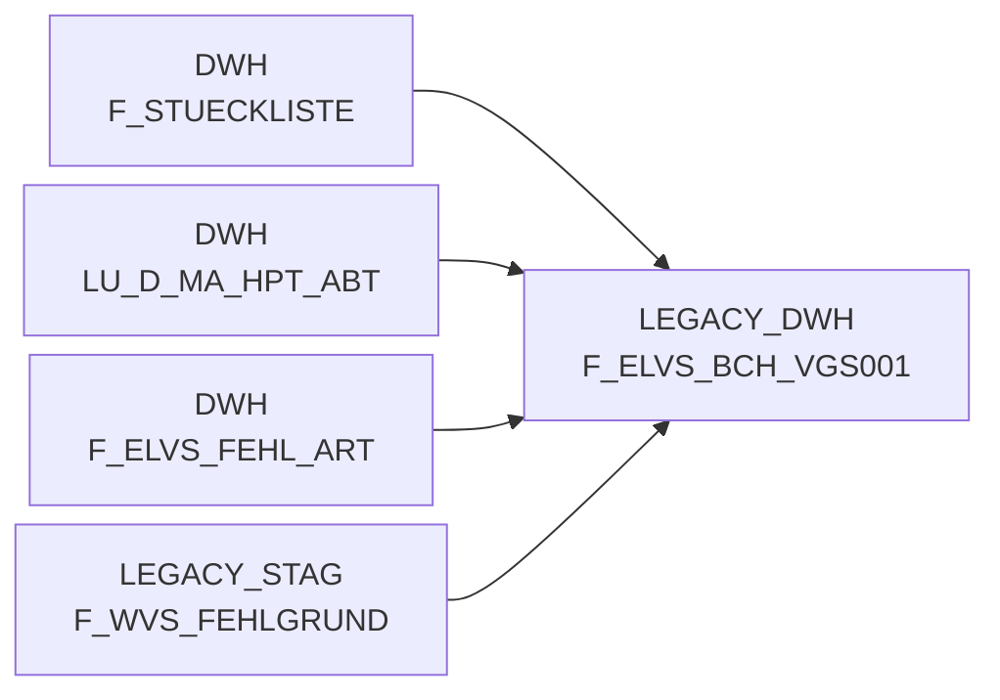

# F_ELVS_BCH_VGS001 (Table)

## Table Description

_No description available_

## Lineage / Impact

## References

The table F_ELVS_BCH_VGS001 is used in the following SAS programs:

| Application | SAS Program |
|---|---|
| [BDWH_SCCWVS](../../Applications/BDWH_SCCWVS) | [sccwvs_400_fakt_n_dwh.sas](../../Applications/BDWH_SCCWVS/sccwvs_400_fakt_n_dwh.sas) |
## Table Schema

| Field Name | Datatype | Precision | Scale | Is Nullable | Constraint | Description |
|---|---|---|---|---|---|---|
| MA_LAG_ID | NUMBER | 10 | 0 | TRUE |   | Market Lager ID - Identifier for the market warehouse |
| NAN_ART_ID | NUMBER | 9 | 0 | TRUE |   | NAN Article ID - Identifier for the article |
| KAL_TAG_ID | DATE |  |  | TRUE |   | Calendar Day ID - Date identifier for the calendar day |
| BCH_MENGE | NUMBER | 12 | 3 | TRUE |   | BCH Quantity - Quantity amount for BCH processing |