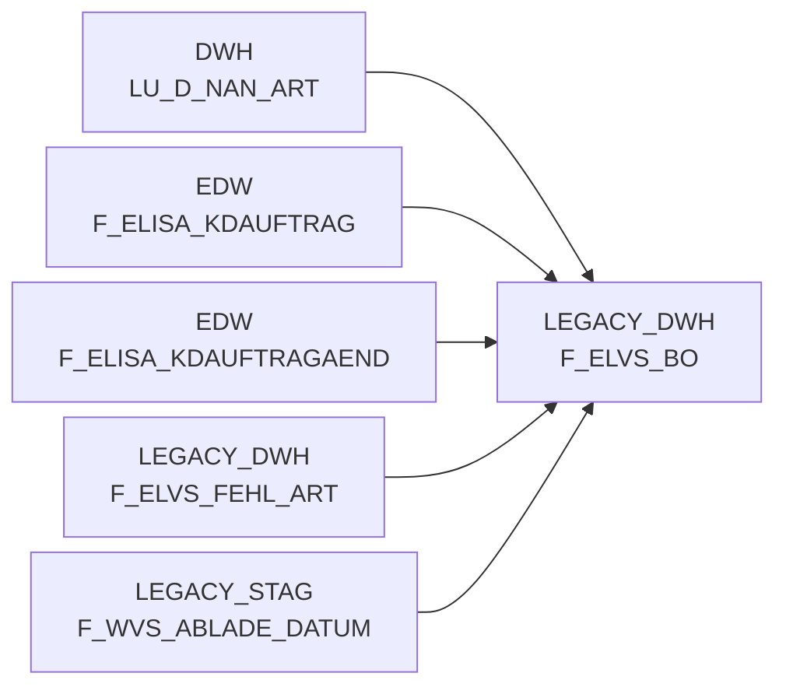

# F_ELVS_BO (Table)

## Table Description

_No description available_

## Lineage / Impact

## References

The table F_ELVS_BO is used in the following SAS programs:

| Application | SAS Program |
|---|---|
| [BDWH_SCCWVS](../../Applications/BDWH_SCCWVS) | [sccwvs_020_wvs_berechnen_elab.sas](../../Applications/BDWH_SCCWVS/sccwvs_020_wvs_berechnen_elab.sas) |
## Table Schema

| Field Name | Datatype | Precision | Scale | Is Nullable | Constraint | Description |
|---|---|---|---|---|---|---|
| KAL_TAG_ID | DATE |  |  | FALSE | PRIMARY KEY | Calendar day identifier for the business operation |
| LAGNR | VARCHAR | 3 |  | FALSE | PRIMARY KEY | Warehouse number identifier |
| K_REFNR | NUMBER | 11 |  | FALSE | PRIMARY KEY | Header reference number |
| K_LIEF_ID | VARCHAR | 6 |  | TRUE |   | Header supplier identifier |
| K_LIFART | VARCHAR | 2 |  | TRUE |   | Header delivery type |
| K_LIFSCHN_NR | NUMBER | 11 |  | TRUE |   | Header delivery schedule number |
| K_AUFTRAG | NUMBER | 11 |  | TRUE |   | Header order number |
| K_KD_AUFTRAGS_NR | VARCHAR | 15 |  | TRUE |   | Header customer order number |
| K_AENDDAT | DATE |  |  | TRUE |   | TRUE |
| K_STORNO_KZ | VARCHAR | 1 |  | TRUE |   | Header cancellation indicator |
| P_REFNR_LFDNR | NUMBER | 6 |  | FALSE | PRIMARY KEY | Position reference number sequence |
| P_NAN_ART_ID | NUMBER | 9 |  | FALSE | PRIMARY KEY | Position article identifier |
| P_AKT_KZ | VARCHAR | 1 |  | FALSE | PRIMARY KEY | Position action indicator |
| P_WAEINH | NUMBER | 6 |  | FALSE | PRIMARY KEY | Position unit of measure |
| P_BESTMNG | NUMBER | 12 | 3 | TRUE |   | Position ordered quantity |
| P_LIFEINH | NUMBER | 6 |  | TRUE |   | Position delivery unit |
| P_LIFMNG | NUMBER | 12 | 3 | TRUE |   | Position delivered quantity |
| P_AENDDAT | DATE |  |  | TRUE |   | TRUE |
| P_AENDZEIT | TIME |  |  | TRUE |   | TRUE |
| MA_LAG_ID | NUMBER | 10 |  | FALSE |   | Market warehouse identifier |
| MA_HPT_ABT_ID | NUMBER | 12 |  | FALSE |   | Market main department identifier |