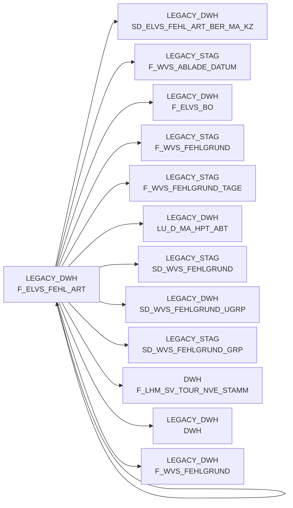

# F_ELVS_FEHL_ART (Table)

## Table Description

_No description available_

## Lineage / Impact

## References

The table F_ELVS_FEHL_ART is used in the following SAS programs:

| Application | SAS Program |
|---|---|
| [BDWH_SCCWVS](../../Applications/BDWH_SCCWVS) | [sccwvs_020_wvs_berechnen_elab.sas](../../Applications/BDWH_SCCWVS/sccwvs_020_wvs_berechnen_elab.sas) |
| [BDWH_SCCWVS](../../Applications/BDWH_SCCWVS) | [sccwvs_005_wvs_ablade_tag.sas](../../Applications/BDWH_SCCWVS/sccwvs_005_wvs_ablade_tag.sas) |
## Table Schema

| Field Name | Datatype | Precision | Scale | Is Nullable | Constraint | Description |
|---|---|---|---|---|---|---|
| MA_HPT_ABT_ID | NUMBER | 12 | 0 | TRUE |   | Market main department ID |
| MA_LAG_ID | NUMBER | 10 | 0 | TRUE |   | Market warehouse ID |
| LAGNR | VARCHAR | 3 | 0 | TRUE |   | Warehouse number |
| REFNR | NUMBER | 11 | 0 | TRUE |   | Reference number |
| POS_REFNR_LFDNR | NUMBER | 6 | 0 | TRUE |   | Position reference number sequence |
| KAL_TAG_ID | DATE |  |  | TRUE |   | Calendar day ID |
| NAN_ART_ID | NUMBER | 9 | 0 | TRUE |   | Article ID |
| AKT_KZ | VARCHAR | 1 | 0 | TRUE |   | Action indicator |
| POS_WAEINH | NUMBER | 6 | 0 | TRUE |   | Position goods unit |
| LIEF_ID | VARCHAR | 6 | 0 | TRUE |   | Supplier ID |
| POS_KUERZ_GLOBAL_KZ | VARCHAR | 1 | 0 | TRUE |   | Position shortening global indicator |
| POS_KUERZ_KST_KZ | VARCHAR | 1 | 0 | TRUE |   | Position shortening cost center indicator |
| POS_KV_URSACHE | VARCHAR | 2 | 0 | TRUE |   | Position cause code |
| POS_WA_IST | NUMBER | 12 | 3 | TRUE |   | Position actual goods |
| BEST_MG | NUMBER | 12 | 3 | TRUE |   | Order quantity |
| BEST_W_EK_BTO | NUMBER | 12 | 3 | TRUE |   | Order value purchase price gross |
| BEST_W_WG_BTO | NUMBER | 12 | 3 | TRUE |   | Order value goods price gross |
| BEST_W_VK_BTO | NUMBER | 12 | 3 | TRUE |   | Order value sales price gross |
| KOPF_LIFART | VARCHAR | 2 | 0 | TRUE |   | Header delivery type |
| ERS_LIEF_MG | NUMBER | 12 | 3 | TRUE |   | First delivery quantity |
| ERS_LIEF_W_EK_BTO | NUMBER | 12 | 3 | TRUE |   | First delivery value purchase price gross |
| ERS_LIEF_W_WG_BTO | NUMBER | 12 | 3 | TRUE |   | First delivery value goods price gross |
| ERS_LIEF_W_VK_BTO | NUMBER | 12 | 3 | TRUE |   | First delivery value sales price gross |
| POS_DIFFMNG | NUMBER | 12 | 3 | TRUE |   | Position difference quantity |
| KUERZ_MG | NUMBER | 12 | 3 | TRUE |   | Shortening quantity |
| KUERZ_MG_AKTION | NUMBER | 12 | 3 | TRUE |   | Shortening quantity action |
| POS_FEHLER_SCHL | NUMBER | 3 | 0 | TRUE |   | Position error key |
| POS_NACHLIEF_KZ | VARCHAR | 1 | 0 | TRUE |   | Position subsequent delivery indicator |
| POS_IFCO_TYP | VARCHAR | 10 | 0 | TRUE |   | Position IFCO type |
| KOPF_AUFTRAG | NUMBER | 11 | 0 | TRUE |   | Header order number |
| KOPF_KD_AUFTRAGS_NR | VARCHAR | 15 | 0 | TRUE |   | Header customer order number |
| KOPF_AENDDAT | DATE |  |  | TRUE |   | Header change date |
| HERKUNFT_BASIS | VARCHAR | 4 | 0 | TRUE |   | Origin basis |
| KOPF_HERKUNFT | VARCHAR | 1 | 0 | TRUE |   | Header origin |
| LIF_NVE | NUMBER | 11 | 0 | TRUE |   | Delivery NVE |
| POS_LEERGUTKZ | VARCHAR | 1 | 0 | TRUE |   | Position empty goods indicator |
| KOPF_STORNO_KZ | VARCHAR | 1 | 0 | TRUE |   | Header cancellation indicator |
| POS_REFNR_LFDNR_B | NUMBER | 6 | 0 | TRUE |   | Position reference number sequence B |
| KOPF_LIFSCHN_NR | NUMBER | 11 | 0 | TRUE |   | Header delivery section number |