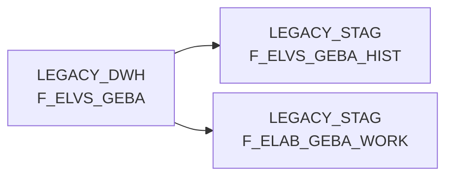

# F_ELVS_GEBA (Table)

## Table Description

_No description available_

## Lineage / Impact

## References

The table F_ELVS_GEBA is used in the following SAS programs:

| Application | SAS Program |
|---|---|
| [BDWH_ELABGEBA](../../Applications/BDWH_ELABGEBA) | [snow_elabgeba_100_geba_artlag_zusammenf.sas](../../Applications/BDWH_ELABGEBA/snow_elabgeba_100_geba_artlag_zusammenf.sas) |
## Table Schema

| Field Name | Datatype | Precision | Scale | Is Nullable | Constraint | Description |
|---|---|---|---|---|---|---|
| MA_LAG_ID | INTEGER |  |  | FALSE | PRIMARY KEY | Material Lager ID |
| LAGNR | VARCHAR | 3 |  | FALSE | PRIMARY KEY | Lager Nummer |
| NAN_ART_ID | INTEGER |  |  | FALSE | PRIMARY KEY | NAN Artikel ID |
| AKT_KZ | VARCHAR | 1 |  | FALSE | PRIMARY KEY | Aktiv Kennzeichen |
| WAEINH | VARCHAR | 10 |  | FALSE | PRIMARY KEY | Warenausgangseinheit |
| LOKAL_KZ | VARCHAR | 1 |  | TRUE |   | Lokal Kennzeichen |
| ZUSATZTEXT | VARCHAR | 255 |  | TRUE |   | Zusatztext |
| HKLASSE | VARCHAR | 10 |  | TRUE |   | Handelsklasse |
| UPDKZ | VARCHAR | 1 |  | TRUE |   | Update Kennzeichen |
| GUEVDAT | DATE |  |  | TRUE |   | Gueltig von Datum |
| GUEBDAT | DATE |  |  | TRUE |   | Gueltig bis Datum |
| GEFAHRENGUT_KZ | VARCHAR | 1 |  | TRUE |   | Gefahrengut Kennzeichen |
| LAGSTRKZ | VARCHAR | 1 |  | TRUE |   | Lagerstruktur Kennzeichen |
| VPEINH | VARCHAR | 10 |  | TRUE |   | Verpackungseinheit |
| GEWICHT | DECIMAL | 15 | 3 | TRUE |   | Gewicht |
| UPDDAT | DATE |  |  | TRUE |   | Update Datum |
| LAENGE | DECIMAL | 15 | 3 | TRUE |   | Laenge |
| BREITE | DECIMAL | 15 | 3 | TRUE |   | Breite |
| HOEHE | DECIMAL | 15 | 3 | TRUE |   | Hoehe |
| VOLUMEN | DECIMAL | 15 | 9 | TRUE |   | Volumen |
| BRUTTO_GEWICHT | DECIMAL | 15 | 3 | TRUE |   | Brutto Gewicht |
| PAL_HOEHE | DECIMAL | 15 | 3 | TRUE |   | Paletten Hoehe |
| ERZ_LAND | VARCHAR | 3 |  | TRUE |   | Erzeuger Land |
| TARA_KG | DECIMAL | 15 | 3 | TRUE |   | Tara Kilogramm |
| TARA_PROZ | DECIMAL | 5 | 2 | TRUE |   | Tara Prozent |
| ANZ_JE_ROLLC | INTEGER |  |  | TRUE |   | Anzahl je Rollcontainer |
| RAEUMDAT | DATE |  |  | TRUE |   | Raeum Datum |
| ZUGANGSDAT | DATE |  |  | TRUE |   | Zugangs Datum |
| RESTLZ | INTEGER |  |  | TRUE |   | Rest Laufzeit |
| VERFALLDAT | DATE |  |  | TRUE |   | Verfall Datum |
| CHEM_BEH | VARCHAR | 1 |  | TRUE |   | Chemische Behandlung |
| AENDDAT | DATE |  |  | TRUE |   | Aenderungs Datum |
| LAG_ID | INTEGER |  |  | TRUE |   | Lager ID |