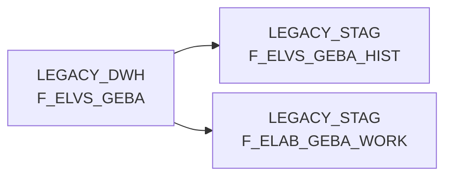

# F_ELVS_GEBA (Table)

## Table Description

**BDWH_ELABGEBA** is a data warehouse application that manages the **ELVS core replacement** process, specifically handling the integration of ELVS GEBA (container unit data for goods outbound) with new data sources from ELISA article warehouse supply.

This table serves as the **legacy ELVS GEBA fact table** containing historical container unit data that was originally sourced from the ELVS system. The table stores comprehensive logistics information including warehouse details, article identifiers, container specifications, weights, dimensions, and validity periods.

The application processes data through a **three-step ETL pipeline** (DW013803, DW013804, DW013805) that:
- Consolidates ELVS GEBA data with new ELISA XML message sources
- Merges stockkeeping unit and logistic factor entities
- Maintains historical data integrity during the transition

This table is being **gradually replaced** by new target tables (DMA.F_ELAB_GEBA) as part of the ELVS modernization initiative. The data migration prioritizes newer ELISA sources while preserving legacy ELVS records where no updated information exists. Views like MSI_DWH.V_ELVS_GEBA will eventually be redirected to the new consolidated tables once the replacement process is complete.

## Lineage / Impact



## Statements

The following statements create/modify this table:

<Util>INSERT</Util> inside [BDWH_ELABGEBA/snow_elabgeba_100_geba_artlag_zusammenf.sas](../../Applications/BDWH_ELABGEBA/snow_elabgeba_100_geba_artlag_zusammenf.sas):
```sql:line-numbers
DELETE FROM PRODUCT_LSP_LEGACY_PROD.LEGACY_STAG.F_ELAB_GEBA_WORK
INSERT INTO PRODUCT_LSP_LEGACY_PROD.LEGACY_STAG.F_ELAB_GEBA_WORK
( MA_LAG_ID, LAGNR, NAN_ART_ID , AKT_KZ
, WAEINH, LOKAL_KZ, ZUSATZTEXT , HKLASSE, UPDKZ, GUEVDAT, GUEBDAT
, GEFAHRENGUT_KZ, LAGSTRKZ, VPEINH, GEWICHT , UPDDAT, LAENGE, BREITE, HOEHE
, VOLUMEN , BRUTTO_GEWICHT, PAL_HOEHE, ERZ_LAND , TARA_KG, TARA_PROZ
, ANZ_JE_ROLLC, RAEUMDAT, ZUGANGSDAT, RESTLZ, VERFALLDAT, CHEM_BEH
, AENDDAT, LAG_ID , ROWNUM, GUELT_VON , GUELT_BIS , ACTIVE, AKTUELL, HERKUNFT_BASIS
)
SELECT
T1.MA_LAG_ID MA_LAG_ID
, ltrim(to_char(T1.LAGERNUMMER, '000')) LAGNR
, T1.NAN_ART_ID NAN_ART_ID
, T1.AKT_KZ AKT_KZ
, COALESCE (T1.WAEINHEIT, T2.WEEINHEIT) WAEINH
, ' ' LOKAL_KZ
, ' ' ZUSATZTEXT
, ' ' HKLASSE
, ' ' UPDKZ
, T1.SKU_GUELTIG_VON GUEVDAT
, T1.SKU_GUELTIG_BIS GUEBDAT
, ' ' GEFAHRENGUT_KZ
, ' ' LAGSTRKZ
, ' ' VPEINH
, COALESCE(T2.NETTOGEWICHT*1000, T2.GEWICHT) GEWICHT
, '1900-01-01' UPDDAT
, COALESCE(T1.LAENGE, T2.TIEFE ) LAENGE
, COALESCE(T1.BREITE, T2.BREITE) BREITE
, COALESCE(T1.HOEHE, T2.HOEHE) HOEHE
, COALESCE(CAST(T1.LAENGE AS FLOAT), CAST(T2.TIEFE AS FLOAT))*COALESCE(CAST(T1.BREITE AS FLOAT), CAST(T2.BREITE AS FLOAT))*COALESCE(CAST(T1.HOEHE AS FLOAT), CAST(T2.HOEHE AS FLOAT))/1000000000 VOLUMEN
, COALESCE(T1.BRUTTOGEWICHT*1000, T2.GEWICHT) BRUTTO_GEWICHT
, COALESCE(T1.PALETTENHOEHE, T2.PALETTENHOEHE) PAL_HOEHE
, ' ' ERZ_LAND
, 0 TARA_KG
, 0 TARA_PROZ
, 0 ANZ_JE_ROLLC
, '2999-12-31' RAEUMDAT
, '1900-01-01' ZUGANGSDAT
, 0 RESTLZ
, '1900-01-01' VERFALLDAT
, ' ' CHEM_BEH
, CAST (T1.VERSORGUNG_TS AS DATE) AENDDAT
, T1.LAG_ID LAG_ID
, ROW_NUMBER() OVER(PARTITION BY T1.MA_LAG_ID, T1.NAN_ART_ID, T1.AKT_KZ, T1.WAEINHEIT
ORDER BY T1.SKU_GUELTIG_VON DESC, T1.SKU_GUELTIG_BIS DESC, T1.VERSORGUNG_TS DESC) ROWNUM
, CURRENT_DATE GUELT_VON
, '9999-12-31' GUELT_BIS
, 0 ACTIVE
, 1 AKTUELL
, 'ELAB' HERKUNFT_BASIS
FROM PRODUCT_LSP_LEGACY_PROD.LEGACY_EDW.D_ELISA_ARTLAGSTOCKKEEPINGUNIT T1
LEFT JOIN (SELECT MA_LAG_ID MA_LAG_ID, NAN_ART_ID NAN_ART_ID, AKT_KZ AKT_KZ, WEEINHEIT
, MAX(TIEFE) TIEFE, MAX(BREITE) BREITE, MAX(HOEHE) HOEHE, MAX(NETTOGEWICHT) NETTOGEWICHT
, MAX(GEWICHT) GEWICHT, MAX(PALETTENHOEHE) PALETTENHOEHE
FROM PRODUCT_LSP_LEGACY_PROD.LEGACY_EDW.D_ELISA_ARTLAGLOGISTFAKTOREN
GROUP BY MA_LAG_ID, NAN_ART_ID, AKT_KZ, WEEINHEIT) T2
ON T1.MA_LAG_ID = T2.MA_LAG_ID
AND T1.NAN_ART_ID = T2. NAN_ART_ID
AND T1.AKT_KZ = T2.AKT_KZ
AND T1.WAEINHEIT = T2.WEEINHEIT
QUALIFY ROWNUM=1
INSERT INTO PRODUCT_LSP_LEGACY_PROD.LEGACY_STAG.F_ELAB_GEBA_WORK
SELECT T1.* FROM PRODUCT_LSP_LEGACY_PROD.LEGACY_DWH.F_ELVS_GEBA T1
WHERE NOT EXISTS (SELECT * FROM PRODUCT_LSP_LEGACY_PROD.LEGACY_STAG.F_ELAB_GEBA_WORK T2
WHERE T1.MA_LAG_ID = T2.MA_LAG_ID AND T1.NAN_ART_ID = T2.NAN_ART_ID AND T1.AKT_KZ = T2.AKT_KZ AND T1.WAEINH = T2.WAEINH)
```

## References

The table F_ELVS_GEBA is used in the following SAS programs:

| Application | SAS Program |
|---|---|
| [BDWH_ELABGEBA](../../Applications/BDWH_ELABGEBA) | [snow_elabgeba_100_geba_artlag_zusammenf.sas](../../Applications/BDWH_ELABGEBA/snow_elabgeba_100_geba_artlag_zusammenf.sas) |
## Table Schema

| Field Name | Datatype | Precision | Scale | Is Nullable | Constraint | Description |
|---|---|---|---|---|---|---|
| MA_LAG_ID | INTEGER |  |  | FALSE | PRIMARY KEY | Material Lager ID |
| LAGNR | VARCHAR | 3 |  | FALSE | PRIMARY KEY | Lager Nummer |
| NAN_ART_ID | INTEGER |  |  | FALSE | PRIMARY KEY | NAN Artikel ID |
| AKT_KZ | VARCHAR | 1 |  | FALSE | PRIMARY KEY | Aktiv Kennzeichen |
| WAEINH | VARCHAR | 10 |  | FALSE | PRIMARY KEY | Warenausgangseinheit |
| LOKAL_KZ | VARCHAR | 1 |  | TRUE |   | Lokal Kennzeichen |
| ZUSATZTEXT | VARCHAR | 255 |  | TRUE |   | Zusatztext |
| HKLASSE | VARCHAR | 10 |  | TRUE |   | Handelsklasse |
| UPDKZ | VARCHAR | 1 |  | TRUE |   | Update Kennzeichen |
| GUEVDAT | DATE |  |  | TRUE |   | Gueltig von Datum |
| GUEBDAT | DATE |  |  | TRUE |   | Gueltig bis Datum |
| GEFAHRENGUT_KZ | VARCHAR | 1 |  | TRUE |   | Gefahrengut Kennzeichen |
| LAGSTRKZ | VARCHAR | 1 |  | TRUE |   | Lagerstruktur Kennzeichen |
| VPEINH | VARCHAR | 10 |  | TRUE |   | Verpackungseinheit |
| GEWICHT | DECIMAL | 15 | 3 | TRUE |   | Gewicht |
| UPDDAT | DATE |  |  | TRUE |   | Update Datum |
| LAENGE | DECIMAL | 15 | 3 | TRUE |   | Laenge |
| BREITE | DECIMAL | 15 | 3 | TRUE |   | Breite |
| HOEHE | DECIMAL | 15 | 3 | TRUE |   | Hoehe |
| VOLUMEN | DECIMAL | 15 | 9 | TRUE |   | Volumen |
| BRUTTO_GEWICHT | DECIMAL | 15 | 3 | TRUE |   | Brutto Gewicht |
| PAL_HOEHE | DECIMAL | 15 | 3 | TRUE |   | Paletten Hoehe |
| ERZ_LAND | VARCHAR | 3 |  | TRUE |   | Erzeuger Land |
| TARA_KG | DECIMAL | 15 | 3 | TRUE |   | Tara Kilogramm |
| TARA_PROZ | DECIMAL | 5 | 2 | TRUE |   | Tara Prozent |
| ANZ_JE_ROLLC | INTEGER |  |  | TRUE |   | Anzahl je Rollcontainer |
| RAEUMDAT | DATE |  |  | TRUE |   | Raeum Datum |
| ZUGANGSDAT | DATE |  |  | TRUE |   | Zugangs Datum |
| RESTLZ | INTEGER |  |  | TRUE |   | Rest Laufzeit |
| VERFALLDAT | DATE |  |  | TRUE |   | Verfall Datum |
| CHEM_BEH | VARCHAR | 1 |  | TRUE |   | Chemische Behandlung |
| AENDDAT | DATE |  |  | TRUE |   | Aenderungs Datum |
| LAG_ID | INTEGER |  |  | TRUE |   | Lager ID |