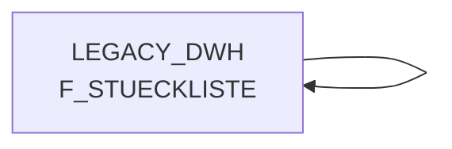

# F_STUECKLISTE (Table)

## Table Description

_No description available_

## Lineage / Impact



## Statements

The following statements create/modify this table:

<Util>CREATE TABLE</Util> inside [BDWH_SCCWVS/sccwvs_030_wvs_erst_lief_aus_stkl20.sas](../../Applications/BDWH_SCCWVS/sccwvs_030_wvs_erst_lief_aus_stkl20.sas):
```sql:line-numbers
create table WRKWVS.STKL_20_LAGER_ALLE as
select * from connection to snow(
select DISTINCT A.KOPF_ART_ID, a.POS_ART_ID
from LEGACY_DWH.DWH.F_STUECKLISTE a
join LEGACY_DWH.DWH.LU_D_MA_LAG B
on a.MA_LAG_ID = B.MA_LAG_ID
where a.STKL_TYP_ID = 20
)
```

## References

The table F_STUECKLISTE is used in the following SAS programs:

| Application | SAS Program |
|---|---|
| [BDWH_SCCWVS](../../Applications/BDWH_SCCWVS) | [sccwvs_030_wvs_erst_lief_aus_stkl20.sas](../../Applications/BDWH_SCCWVS/sccwvs_030_wvs_erst_lief_aus_stkl20.sas) |
## Table Schema

| Field Name | Datatype | Precision | Scale | Is Nullable | Constraint | Description |
|---|---|---|---|---|---|---|
| KOPF_ART_ID | NUMBER | 38 | 0 | TRUE |   | ID of the header article in the bill of materials |
| POS_ART_ID | NUMBER | 38 | 0 | TRUE |   | ID of the position article in the bill of materials |
| MA_LAG_ID | NUMBER | 38 | 0 | TRUE |   | Warehouse ID |
| STKL_TYP_ID | NUMBER | 38 | 0 | TRUE |   | Bill of materials type ID |
| STKL_GUELT_VON | DATE |  |  | TRUE |   | Bill of materials valid from date |
| STKL_GUELT_BIS | DATE |  |  | TRUE |   | Bill of materials valid until date |
| MA_TREG_LBER_ID | NUMBER | 38 | 0 | TRUE |   | Trading region delivery area ID |