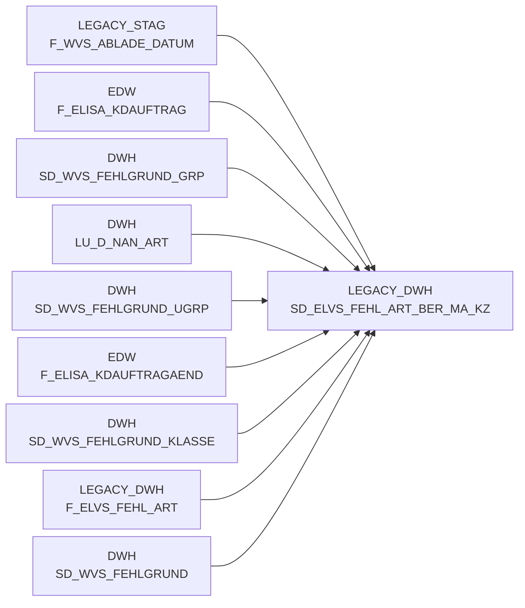

# SD_ELVS_FEHL_ART_BER_MA_KZ (Table)

## Table Description

_No description available_

## Lineage / Impact

## Statements

The following statements create/modify this table:

## References

The table SD_ELVS_FEHL_ART_BER_MA_KZ is used in the following SAS programs:

| Application | SAS Program |
|---|---|
| [BDWH_SCCWVS](../../Applications/BDWH_SCCWVS) | [sccwvs_400_fakt_n_dwh.sas](../../Applications/BDWH_SCCWVS/sccwvs_400_fakt_n_dwh.sas) |
| [BDWH_SCCWVS](../../Applications/BDWH_SCCWVS) | [sccwvs_020_wvs_berechnen_elab.sas](../../Applications/BDWH_SCCWVS/sccwvs_020_wvs_berechnen_elab.sas) |
## Table Schema

| Field Name | Datatype | Precision | Scale | Is Nullable | Constraint | Description |
|---|---|---|---|---|---|---|
| BERECHTIGT_MARKT_KZ | VARCHAR | 10 | 0 | TRUE |   | Market authorization indicator for ELVS error article |
| BERECHTIGT_MARKT_TXT | VARCHAR | 255 | 0 | TRUE |   | Market authorization text description for ELVS error article |
| ERSTELL_DATUM | DATE | 0 | 0 | TRUE |   | Creation date of the record |
| AENDERUNG_DATUM | DATE | 0 | 0 | TRUE |   | Last modification date of the record |
| SATZ_STATUS | VARCHAR | 1 | 0 | TRUE |   | Record status indicator |