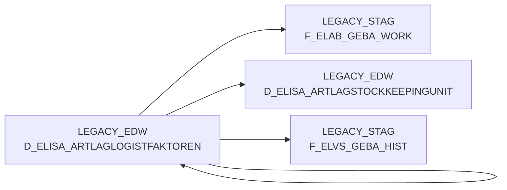

# D_ELISA_ARTLAGLOGISTFAKTOREN (Table)

## Table Description

**BDWH_ELABGEBA** application dimension table containing **logistic factors** for article warehouse management. This table serves as a source for the ELVS core replacement process, specifically storing logistic factor data from ELISA XML messages for article warehouse supply.

The table is used in the **ELVS-ELISA integration process** where it provides supplementary data (dimensions like depth, width, height, net weight, gross weight, pallet height) that complements the primary stockkeeping unit data. It supports the consolidation of legacy ELVS GEBA data with new ELISA data sources.

Key usage includes:
- Providing **dimensional and weight attributes** for warehouse articles
- Supporting **LEFT JOIN operations** with stockkeeping unit data
- Enabling **data enrichment** when primary dimensional data is missing
- Contributing to the **F_ELAB_GEBA** fact table generation

The table contains warehouse-specific logistic parameters grouped by warehouse ID (MA_LAG_ID), article ID (NAN_ART_ID), activity indicator (AKT_KZ), and warehouse unit (WEEINHEIT). It's processed daily as part of the three-job sequence (DW013803-DW013805) that merges ELVS and ELISA data sources for warehouse management reporting.

## Lineage / Impact



## Statements

The following statements create/modify this table:

<Util>SELECT</Util> inside [BDWH_ELABGEBA/snow_elabgeba_100_geba_artlag_zusammenf.sas](../../Applications/BDWH_ELABGEBA/snow_elabgeba_100_geba_artlag_zusammenf.sas):
```sql:line-numbers
SELECT MA_LAG_ID MA_LAG_ID, NAN_ART_ID NAN_ART_ID, AKT_KZ AKT_KZ, WEEINHEIT
, MAX(TIEFE) TIEFE, MAX(BREITE) BREITE, MAX(HOEHE) HOEHE, MAX(NETTOGEWICHT) NETTOGEWICHT
, MAX(GEWICHT) GEWICHT, MAX(PALETTENHOEHE) PALETTENHOEHE
FROM PRODUCT_LSP_LEGACY_PROD.LEGACY_EDW.D_ELISA_ARTLAGLOGISTFAKTOREN
GROUP BY MA_LAG_ID, NAN_ART_ID, AKT_KZ, WEEINHEIT
```

## References

The table D_ELISA_ARTLAGLOGISTFAKTOREN is used in the following SAS programs:

| Application | SAS Program |
|---|---|
| [BDWH_ELABGEBA](../../Applications/BDWH_ELABGEBA) | [snow_elabgeba_100_geba_artlag_zusammenf.sas](../../Applications/BDWH_ELABGEBA/snow_elabgeba_100_geba_artlag_zusammenf.sas) |
## Table Schema

| Field Name | Datatype | Precision | Scale | Is Nullable | Constraint | Description |
|---|---|---|---|---|---|---|
| MA_LAG_ID | INTEGER | NULL | NULL | TRUE |   | Lager ID |
| NAN_ART_ID | INTEGER | NULL | NULL | TRUE |   | Artikel ID |
| AKT_KZ | VARCHAR | NULL | NULL | TRUE |   | Aktiv Kennzeichen |
| WEEINHEIT | VARCHAR | NULL | NULL | TRUE |   | Wareneingangseinheit |
| TIEFE | FLOAT | NULL | NULL | TRUE |   | Tiefe in mm |
| BREITE | FLOAT | NULL | NULL | TRUE |   | Breite in mm |
| HOEHE | FLOAT | NULL | NULL | TRUE |   | Hoehe in mm |
| NETTOGEWICHT | FLOAT | NULL | NULL | TRUE |   | Nettogewicht |
| GEWICHT | FLOAT | NULL | NULL | TRUE |   | Gewicht |
| PALETTENHOEHE | FLOAT | NULL | NULL | TRUE |   | Palettenhoehe |