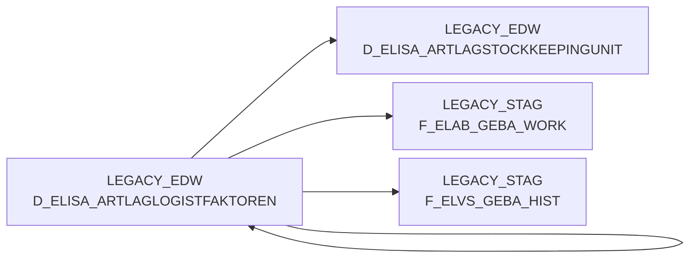

# D_ELISA_ARTLAGLOGISTFAKTOREN (Table)

## Table Description

_No description available_

## Lineage / Impact

## References

The table D_ELISA_ARTLAGLOGISTFAKTOREN is used in the following SAS programs:

| Application | SAS Program |
|---|---|
| [BDWH_ELABGEBA](../../Applications/BDWH_ELABGEBA) | [snow_elabgeba_100_geba_artlag_zusammenf.sas](../../Applications/BDWH_ELABGEBA/snow_elabgeba_100_geba_artlag_zusammenf.sas) |
## Table Schema

| Field Name | Datatype | Precision | Scale | Is Nullable | Constraint | Description |
|---|---|---|---|---|---|---|
| MA_LAG_ID | INTEGER | NULL | NULL | TRUE |   | Lager ID |
| NAN_ART_ID | INTEGER | NULL | NULL | TRUE |   | Artikel ID |
| AKT_KZ | VARCHAR | NULL | NULL | TRUE |   | Aktiv Kennzeichen |
| WEEINHEIT | VARCHAR | NULL | NULL | TRUE |   | Wareneingangseinheit |
| TIEFE | FLOAT | NULL | NULL | TRUE |   | Tiefe in mm |
| BREITE | FLOAT | NULL | NULL | TRUE |   | Breite in mm |
| HOEHE | FLOAT | NULL | NULL | TRUE |   | Hoehe in mm |
| NETTOGEWICHT | FLOAT | NULL | NULL | TRUE |   | Nettogewicht |
| GEWICHT | FLOAT | NULL | NULL | TRUE |   | Gewicht |
| PALETTENHOEHE | FLOAT | NULL | NULL | TRUE |   | Palettenhoehe |